# React Infrastructure Architecture

Authoritative reference for the React 18 application in `app/react_web/src`, the layers it is built from, and the Rails response-shaping layer that feeds it.

**Audience:** engineers and AI agents making changes to the React app. Read this before adding a module, a screen, an endpoint, or a slice.

**Scope:** the architecture is described **frontend-first**. The backend appears only where the frontend depends on it: serializers, presenters, the response envelope, key casing, flash messages, and bootstrap config.

**Companion rules:** `.cursor/rules/react-frontend.mdc`, `.cursor/rules/react-module-scaffolding.mdc`, `.cursor/rules/build-system.mdc`.

---

## Table of Contents

1. [The One Diagram](#1-the-one-diagram)
2. [Why This Architecture Exists](#2-why-this-architecture-exists)
3. [Layer Responsibility Contract](#3-layer-responsibility-contract)
4. [Bootstrap: Rails to React Handoff](#4-bootstrap-rails-to-react-handoff)
5. [Routing](#5-routing)
6. [Presentation Layers: Screens, Containers, Templates, Components](#6-presentation-layers)
7. [Hooks: The Orchestration Layer](#7-hooks-the-orchestration-layer)
8. [Generators: Declarative UI Descriptors](#8-generators-declarative-ui-descriptors)
9. [Redux Store: Slices and Thunks](#9-redux-store-slices-and-thunks)
10. [API Layer: The Network Boundary](#10-api-layer-the-network-boundary)
11. [Parsers, ModelDataConverter, and Models](#11-parsers-modeldataconverter-and-models)
12. [i18n and Tenant Custom Labels](#12-i18n-and-tenant-custom-labels)
13. [Cross-Cutting Infrastructure](#13-cross-cutting-infrastructure)
14. [Backend Contract: Serializers, Presenters, Envelope](#14-backend-contract)
15. [End-to-End Worked Example: Asset Checkout](#15-end-to-end-worked-example-asset-checkout)
16. [Build System and Product Variants](#16-build-system-and-product-variants)
17. [Adding a New Module: Checklist](#17-adding-a-new-module-checklist)
18. [Anti-Patterns and Gotchas](#18-anti-patterns-and-gotchas)
19. [Reference Tables](#19-reference-tables)
20. [Pynwheel Connect (Next.js) — Infrastructure Updates](#20-pynwheel-connect-nextjs--infrastructure-updates)

---

## 1. The One Diagram

This is the complete request/render cycle. Every arrow is a hard boundary: a layer may only talk to the layers it points at.

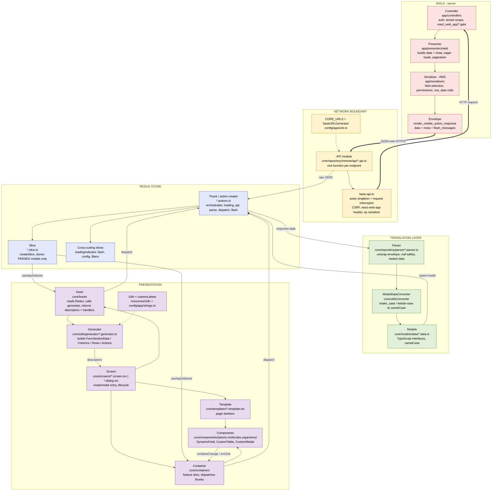

### The pipeline in one line

```
Screen → Hook → dispatch(Thunk) → API module → base.api (axios) → Rails Controller → Presenter → Serializer
       → { data, meta, flash_messages } → Thunk → Parser → ModelDataConverter → typed Model
       → Slice → useAppSelector → Hook → Generator → descriptors → Template → DynamicField / CustomTable
```

### Scale of each layer

| Layer | Path | Count |
|---|---|---:|
| API modules | `core/repository/remote/api/**/*.api.ts` | 102 |
| Parsers | `core/repository/parser/**/*.parser.ts` | 169 |
| Redux slices | `core/store/**/*.slice.ts` | 333 |
| Registered reducers | `core/store/index.ts` | ~340 |
| Generators | `core/utils/generator/**/*.generator.*` | 338 |
| Containers | `core/containers/**` | ~1,700 files |
| Rails serializers | `app/serializers/**/*.rb` | 403 |
| Rails presenters | `app/presenters/**/*.rb` | 179 |
| i18n English values | `resources/i18n/languages/english/localizedStrings.ts` | 7,616 lines |
| i18n key registry | `config/app/strings.ts` | 8,069 lines |

---

## 2. Why This Architecture Exists

The app is a **React 18 SPA embedded inside a Rails 6.1 monolith**, sharing the page shell with legacy jQuery/ERB. Every layer in the diagram exists to solve a specific problem created by that situation.

| Layer | Problem it solves | What breaks without it |
|---|---|---|
| **`base.api.ts`** | Every request must carry `react-web-app: true` (the backend changes behavior on it) and a CSRF token; arrays must serialize as `key[]=` for Rails. | Rails ignores React-specific serializer branches; mutations 422 on CSRF; array filters silently drop. |
| **API modules** | Endpoints are Rails controller paths, not a designed REST API. Centralizing them keeps controller paths out of components. | Literal `/assets.json` strings scattered across 1,700 containers; impossible to change a route. |
| **Parsers + `ModelDataConverter`** | The wire format is **snake_case and kebab-case**, with three different envelope shapes. TypeScript wants camelCase interfaces. | Components read `item["sequence-num"]` and `item.sequence_num` inconsistently; no type safety; date strings never become `Date`. |
| **Models** | A single compile-time contract for domain data shared by 333 slices. | Each slice invents its own shape. |
| **Slices** | Listings, filters, detail panes, and dialogs must share state across unrelated component trees. | Prop-drilling through the listing → table → row → action-menu chain. |
| **Thunks** | Every fetch needs the same five steps: show loader, call API, parse, store, surface flash. | Each screen reimplements loading and error handling differently. |
| **`loadingIndicator` + `flash`** | Consistent loading and notification UX across ~50 modules. | Spinner-per-screen; Rails `flash` silently dropped on XHR. |
| **Generators** | Hundreds of forms and tables share the same field/column abstractions but differ by tenant settings, permissions, and product mode. | Business rules hardcoded into JSX; `DynamicField` cannot be reused. |
| **`DynamicField`** | One renderer for ~40 field types means adding a field type is one change, not 300. | Every form re-implements dropdown/date/checkbox rendering. |
| **Templates** | Listing pages and modal forms share identical chrome. | Header/loading/pagination duplicated per screen. |
| **Hooks** | Screens would otherwise hold Redux reads, effects, generator calls, and URL sync all at once. | 2,000-line screen components. |
| **i18n two-file split** | Keys must be referenceable with type-safe autocomplete (`CORE_STRINGS`) while values stay translatable. | Typo'd raw key strings that fail silently at runtime. |
| **`customLabels`** | Tenants rename modules ("Work Order" → "Job"). This is data, not translation. | Hardcoded module names contradict tenant configuration. |
| **Presenters (Rails)** | Listings need pagination + permissions + column preferences + mass actions in one payload. | N+1 queries and 5 round-trips per listing page. |
| **Serializers (Rails)** | Field selection driven by the user's column picker and role. | Over-fetching every column for every user. |

---

## 3. Layer Responsibility Contract

These boundaries are enforced by convention and code review. Violating them is the main source of architectural decay in this codebase.

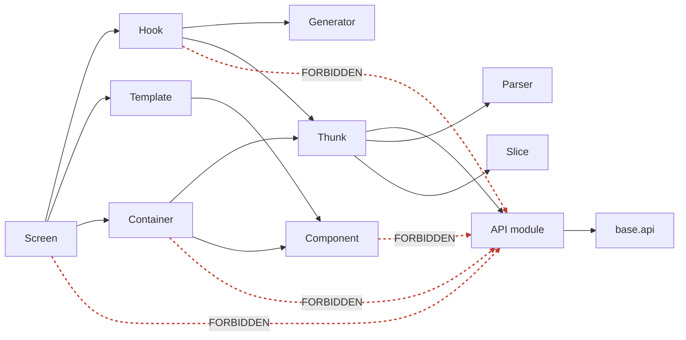

| Layer | Path | MAY | MUST NOT |
|---|---|---|---|
| **Screen** | `core/screens/` | Be a route/modal entry; run init/reset effects; compose hook + template + containers | Call axios or API modules; render individual form fields |
| **Container** | `core/containers/` | Read/write Redux; dispatch thunks; compose components; call generators | Call axios or API modules; define routes |
| **Template** | `core/templates/` | Page skeleton; standard loading/header/pagination | Module-specific fetch or business logic |
| **Component** | `core/components/` | Render UI; local UI state; fire callback props | Call axios; dispatch business thunks; own fetch orchestration |
| **Hook** | `core/hooks/` | Redux; generators; URL params; memoized derived data; dispatch thunks | Call axios directly; render JSX (rare exceptions) |
| **Generator** | `core/utils/generator/` | Pure transform of context → descriptors; call `i18n.t` | Fetch data; hold state; dispatch |
| **Thunk** | `*.actions.ts` | Call API modules; call parsers; dispatch slice actions, loading, flash | Render; be called from a component without `dispatch` |
| **Slice** | `*.slice.ts` | Store **parsed models**; synchronous reducers | Store raw API JSON; perform async work |
| **API module** | `*.api.ts` | One async function per endpoint; build URL from `CORE_URLS`; return response or caught error | Parse data; dispatch; import Redux |
| **Parser** | `*.parser.ts` | Unwrap envelope; null-safety; delegate to `ModelDataConverter` | Fetch; dispatch; render |

**The single most important rule:** only `*.actions.ts` files may sit between an API module and a slice. Nothing else calls the network, and nothing else writes parsed data into the store.

---

## 4. Bootstrap: Rails to React Handoff

React does not own the page. Rails decides, per request, whether to render a legacy ERB page or the React shell — at the **same URL**.

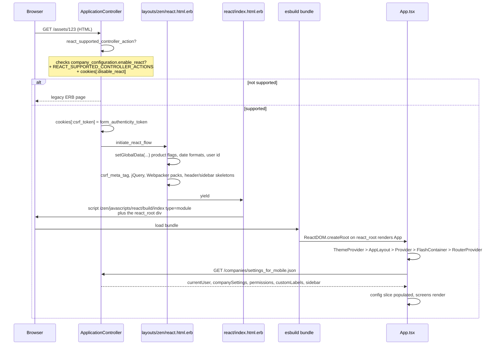

### The gate

```171:201:app/controllers/application_controller.rb
  def react_supported_controller_action?
    return false unless @current_company&.company_configuration&.enable_react?
    # ... bypass rules for search, filter-from-legacy, disable_react cookie ...
    actions = REACT_SUPPORTED_CONTROLLER_ACTIONS[controller_path.to_sym]
    is_react_supported_action = actions&.include?(action_name.to_sym)
    return false unless is_react_supported_action

    cookies[:csrf_token] = form_authenticity_token if is_react_supported_action
    is_react_supported_action
  end

  def initiate_react_flow
    render 'react/index.html.erb', layout: 'zen/react'
  end
```

Whitelist lives in `config/initializers/react_app_constants.rb` (`REACT_SUPPORTED_CONTROLLER_ACTIONS`, 43 controller entries). **Adding a client-side route is not enough — the Rails action must be whitelisted or a hard refresh/deep link renders the legacy page.**

### Mount point

```1:10:app/react_web/src/index.js
import React from "react";
import ReactDOM from "react-dom/client";

import App from "./App";

const container = document.getElementById("react_root");
if (container) {
  const root = ReactDOM.createRoot(container);
  root.render(<App />);
}
```

### Provider stack

```29:47:app/react_web/src/App.tsx
const App: React.FC = () => {
  return (
    <ThemeProvider>
      <AppLayout>
        <Provider store={store}>
          <FlashContainer />

          <CustomSuspense>
            <RouterProvider router={router} />
          </CustomSuspense>
        </Provider>
      </AppLayout>
    </ThemeProvider>
  );
};
```

| Wrapper | Purpose |
|---|---|
| `ThemeProvider` (Zendesk Garden) | Global Garden design tokens |
| `AppLayout` (`core/layouts/app.layout.tsx`) | `ErrorBoundary` + Airbrake reporting + auto-reload on chunk load failure |
| `Provider` | The single Redux store |
| `FlashContainer` | Global toast/banner region, mounted once |
| `CustomSuspense` | `Suspense` + `LoadingIndicator` fallback for lazy routes |
| `RouterProvider` | react-router 6.4 data router |

**Not at the root:** MUI `ThemeProvider` (MUI is used per-component) and no i18n React provider (`i18n-js` is a module singleton).

### Two-stage configuration

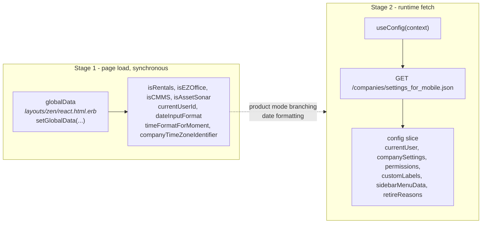

`globalData` is available immediately and synchronously; the `config` slice requires a network round-trip. Screens that need permissions must tolerate `config.companySettings === undefined` on first render — `ListingScreenTemplate` handles this with a loading guard.

```11:46:app/react_web/src/core/hooks/config/useConfig.ts
export const useConfig = (context: string) => {
  const dispatch = useAppDispatch();

  const config = useAppSelector((state) => state.config);
  // ...
  useEffect(() => {
    if (!config.companySettings) {
      dispatch(configActionCreator.fetchSettings(context));
    }
  }, []);

  return config;
};
```

### Who renders the chrome

| Element | Rendered by |
|---|---|
| Header top stripe skeleton, sidebar icon column skeleton | Rails (placeholders) |
| Real Navbar and Sidebar | **React** — `ListingLayout` renders `<Navbar />` and `<Sidebar />` |
| Breadcrumb | Rails provides host `#react-breadcrumb-host`; React portals into it |
| Main content | React, inside `#react_root` |
| Footer, GDPR modals, legacy quick dialogs, flash wrappers | Rails |

---

## 5. Routing

- **Library:** `react-router-dom` 6.4.3
- **API:** `createBrowserRouter` + `RouterProvider` (data router)
- **Basename:** none — client routes are absolute Rails paths (`/assets`, `/tasks`)
- **Route table:** `app/react_web/src/config/routes/routes.tsx` (single table for all products)
- **Path constants:** `AppRoutes` enum in `core/models/enums/appRoutes/appRoutes.enums.ts`

```106:114:app/react_web/src/config/routes/routes.tsx
export const router = createBrowserRouter([
  {
    path: "/",
    element: <Outlet />,
    errorElement: <RouteErrorHandler />,
    children: [
      {
        element: <ListingLayout />, // Main listing wrapper
        children: [
```

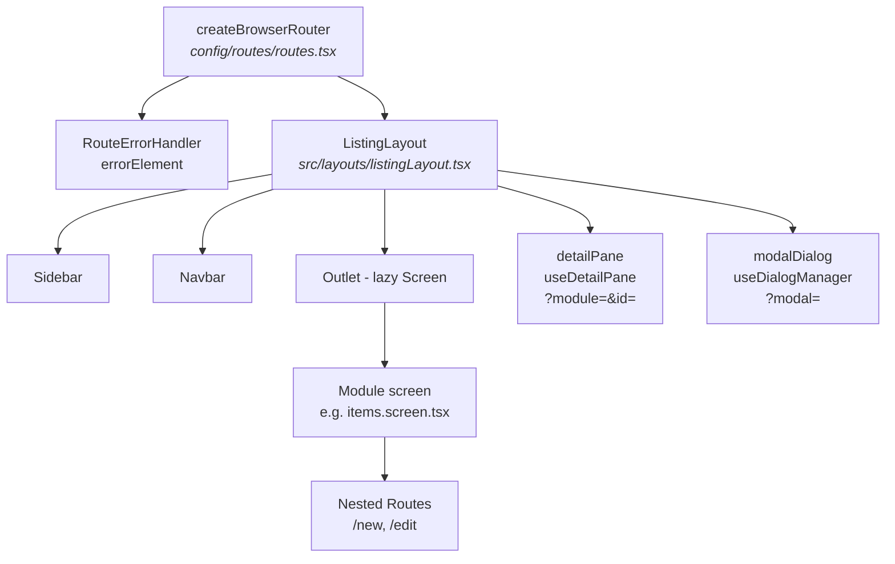

### URL state conventions

Documented in `App.tsx` and enforced by `ListingLayout`:

| Pattern | Meaning | Handled by |
|---|---|---|
| `?module=<module>&id=<id>` | Detail side pane | `useDetailPane` |
| `?modal=<modal_id>` / `?modalId=<id>` | Modal dialog | `useDialogManager` |
| `/module/new`, `/module/:id/edit` | Form routes | Nested `<Routes>` inside the module screen |

### Code splitting

Most screens use `React.lazy(() => import("~screens/..."))`; esbuild `splitting: true` emits hashed chunks. A few screens (`ItemsScreen`, `WorkflowsScreen`, `ThemeSettingsScreen`) are imported eagerly because of barrel-export cycles.

### Product variants do not get separate route tables

There is **one** route table. Product differences are resolved at runtime via `globalData.isRentals` / `isCMMS` / `isAssetSonar` and the `config` slice, and at build time only for colors/labels (see [§16](#16-build-system-and-product-variants)).

---

## 6. Presentation Layers

Four distinct layers, often confused. The distinction is **scope**, not complexity.

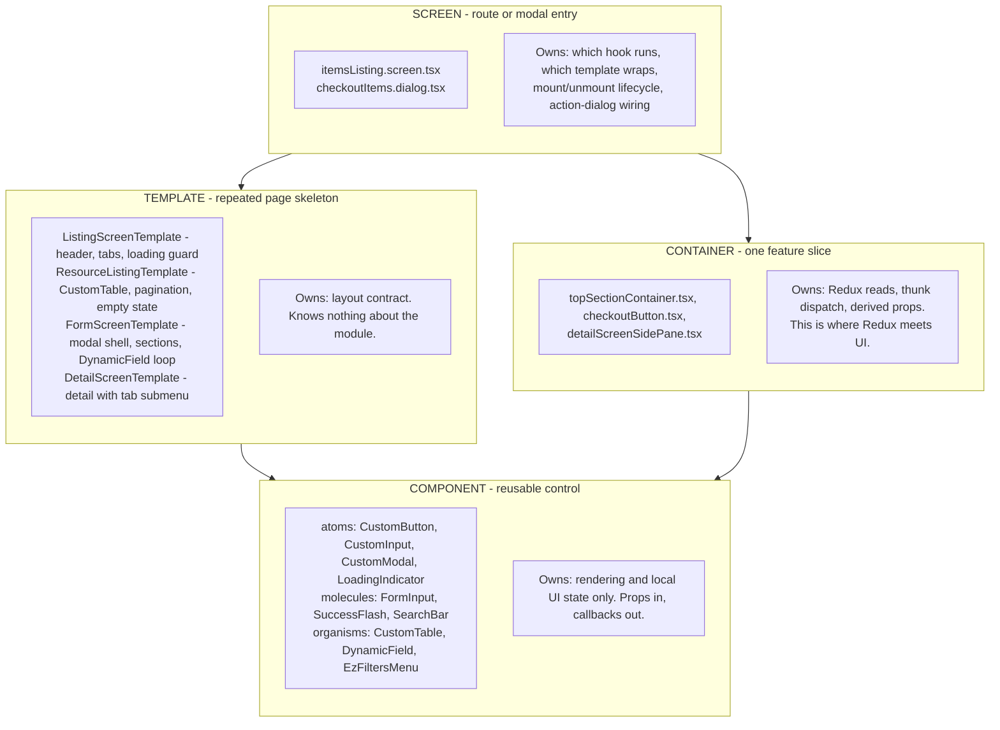

### Screens — `core/screens/`

The top-level component for a route or modal.

| Suffix | Meaning |
|---|---|
| `*.screen.tsx` | Full page / module entry router |
| `*.dialog.tsx` | Modal action or form |
| `*.styles.ts` | Screen-scoped tss-react styles |
| `*.helper.ts`, `*.types.ts` | Screen-local helpers/types |

A listing screen is thin — it picks the hook, picks the templates, and delegates:

```285:309:app/react_web/src/core/screens/items/itemsListing/itemsListing.screen.tsx
  return (
    <ListingScreenTemplate
      route={route}
      context={CONTEXT.items_listing_screen}
      headerTitle={i18n.t(CORE_STRINGS.module_labels.item.plural)}
      submenuItems={getAssetItemsTabs()}
      defaultActiveSubmenuItemId={itemType}
      renderHeaderRightBtns={permissions && renderHeaderRightBtns}
    >
```

### Containers — `core/containers/`

A container composes UI for **one feature slice** and is the layer where Redux meets the DOM. Naming is predominantly camelCase with a role suffix (`topSectionContainer.tsx`, `checkoutButton.tsx`); a few reusable compositions are PascalCase (`AssetListingScreen.tsx`).

`checkoutButton.tsx` is the canonical shape: read validation state from Redux, render a single dumb component, dispatch on click.

```227:241:app/react_web/src/core/containers/items/actions/checkout/checkoutButton.tsx
  return (
    <CustomButton
      id="checkout"
      type={CustomButtonTypes.Primary}
      title={buttonTitle}
      tooltip={
        isValidData
          ? undefined
          : i18n.t(CORE_STRINGS.shared.defaults.some_missing_fields_tooltip)
      }
      disabled={!isValidData}
      ariaLabel={buttonTitle}
      tooltipPlacement="top-end"
      onClick={onSubmitClick}
    />
  );
```

### Templates — `core/templates/`

Five templates cover nearly every page in the app:

| Template | File | Responsibility |
|---|---|---|
| `ListingScreenTemplate` | `listingScreenTemplate/listingScreen.template.tsx` | Header, submenu tabs, config-load guard, context loading indicator |
| `ResourceListingTemplate` | `resourceListingTemplate/resourceListing.template.tsx` | `CustomTable`/`CustomGrid`, pagination, empty state |
| `FormScreenTemplate` | `formScreenTemplate/formScreen.template.tsx` | Modal shell, section loop, `DynamicField` loop, submit/cancel |
| `DetailScreenTemplate` | `detailSection/detailScreen.template.tsx` | Detail view with tab submenu |
| `DetailSectionTemplate` | `detailSection/detailSection.template.tsx` | Detail section layout |

`FormScreenTemplate` is the bridge between generators and components — it is the only place that knows how to turn `FormSectionData[]` into rendered fields:

```222:236:app/react_web/src/core/templates/formScreenTemplate/formScreen.template.tsx
  const renderFormSections = () =>
    fieldData.map((section, index) => {
      if (section.skipSectionHeader) {
        return (
          <div key={index} className={/* ... */}>
            {section.fields?.map((field) => (
              <DynamicField key={field.id} {...field} />
            ))}
            {section.customComponent && section.customComponent()}
          </div>
        );
```

### Components — `core/components/`

Atomic design: `atoms/`, `molecules/`, `organisms/`, plus `charts/` and a couple of domain-specific folders.

```1:5:app/react_web/src/core/components/index.ts
export * from "./atoms";
export * from "./credit_memo";
export { default as DualStatusChip } from "./softwareVulnerability/DualStatusChip";
export * from "./molecules";
export * from "./organisms";
```

**`DynamicField`** (`organisms/dynamicField/dynamicField.tsx`) is the highest-leverage component in the codebase. It switches on `fieldType` against `CustomFieldTypes` groups and renders the right control:

```263:280:app/react_web/src/core/components/organisms/dynamicField/dynamicField.tsx
  const renderField = () => {
    if (CustomFieldTypes.singleLine.includes(fieldType)) {
      return (
        <FormInput
          id={id}
          label={label ?? ""}
          // ...
        />
      );
    } else if (CustomFieldTypes.paragraphText.includes(fieldType)) {
      return (
        <FormTextArea
          // ...
        />
      );
    } else if (CustomFieldTypes.numberField.includes(fieldType)) {
```

Adding a new field type is a change in **one** file plus the `CustomFieldTypes` enum — not in 300 forms.

### Layouts

| Path | Contents | Role |
|---|---|---|
| `core/layouts/` | `app.layout.tsx` only | Infrastructure: global `ErrorBoundary` |
| `src/layouts/` | `listingLayout.tsx`, `navbar/`, `sidebar/` | Application chrome: sidebar, navbar, `<Outlet />`, detail pane and modal hosts |

### Styling

| Mechanism | Status |
|---|---|
| **tss-react** in adjacent `*.styles.ts` with `CORE_COLORS` / `CORE_SPACING` / `CORE_FONTS` | **Canonical for all new code** |
| Zendesk Garden components + `ThemeProvider` | Primary component library |
| MUI `sx` | Acceptable only where MUI layout primitives are already used |
| Bootstrap/global classes (`d-flex`, `spinner-border`) | Legacy, from `public/zen/stylesheets` |
| Inline styles | Not allowed in new components |

```2:16:app/react_web/src/core/tss/tss.ts
import { createTss } from "tss-react";
import { CORE_COLORS } from "~config";
import { utils, media } from "./utils";

function useContext() {
  const myTheme = {
    primaryColor: CORE_COLORS.primary_color
  };

  return { myTheme, utils, media };
}

export const { tss } = createTss({ useContext });
```

**Never edit generated CSS** under `public/zen/stylesheets/` or the build output under `public/zen/javascripts/react/build/`.

### Icons

Canonical library is `resources/images/icons/` — 400+ SVGs as React components, barrel-exported and surfaced as `CORE_IMAGES`. Usage: `<CORE_IMAGES.BackArrowIcon />`. The small `core/icons/` folder is legacy.

---

## 7. Hooks: The Orchestration Layer

Hooks are where screens get their brains. They read Redux, run effects, call generators, sync URL state, and return descriptors plus handlers. This is what keeps screens declarative.

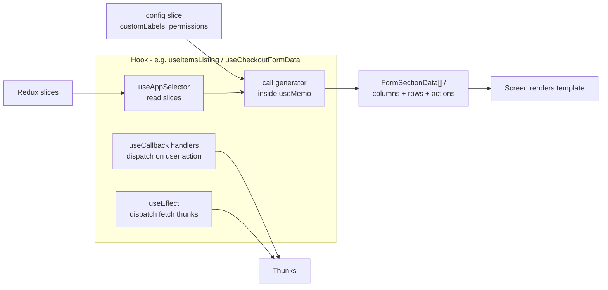

### Typed Redux hooks — mandatory

```1:7:app/react_web/src/core/hooks/store/reduxHooks.ts
import { TypedUseSelectorHook, useDispatch, useSelector } from "react-redux";

import type { RootState, AppDispatch } from "~store";

export const useAppDispatch = () => useDispatch<AppDispatch>();
export const useAppSelector: TypedUseSelectorHook<RootState> = useSelector;
```

Never use untyped `useDispatch`/`useSelector` in new code.

### Hook categories

| Folder | Purpose | Examples |
|---|---|---|
| `hooks/store/` | Typed Redux access | `reduxHooks.ts` |
| `hooks/config/` | Bootstrap config | `useConfig.ts` |
| `hooks/modules/<module>/` | Domain orchestration | `useItemsListing.ts`, `checkoutFormData.ts` |
| `hooks/filters/` | Filter persistence and restore | `useFilters` |
| `hooks/shared/` | Cross-module UI orchestration | `useDialogManager`, `useDetailPane` |
| `hooks/general/` | Pagination, infinite scroll, unsaved-changes guards | |
| `hooks/navigation/` | URL param helpers | |

### Naming caveat

The rule is `useName.ts`, but form-data hooks historically use `<feature>FormData.ts` as the **filename** while exporting `use<Feature>FormData`. For example `hooks/modules/items/checkoutFormData.ts` exports `useCheckoutFormData`. Follow `useName.ts` for new hooks.

---

## 8. Generators: Declarative UI Descriptors

> **Correction to a common assumption:** there is **no** `core/utils/generator/generator.tsx` or `generator.ts`. The entry point is the barrel `core/utils/generator/index.ts`, which namespace-exports 338 generator modules. The alias is `~generator`.

### What a generator is

A **pure TypeScript module that transforms runtime context into declarative descriptors**. It is not a React component, not a code scaffolder, and not a data fetcher.

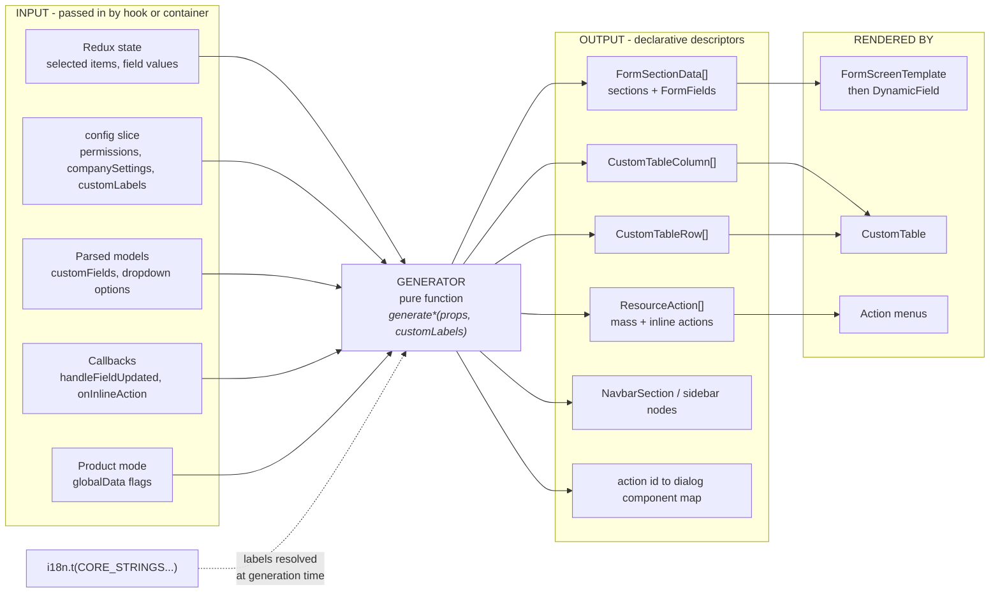

### The contract

Input: context props + `customLabels`. Output: a typed descriptor array. No side effects.

```105:118:app/react_web/src/core/utils/generator/items/checkoutItemsFormData.generator.ts
export const generateFormData = (
  props: FormDataProps,
  customLabels: CustomLabels
): FormSectionData[] => {
  const {
    itemType,
    customFields,
    isMassAction,
    hasParentAssets,
    signaturePadSetting,
    isQuickCheckout
  } = props;

  const data: FormSectionData[] = [];
```

A single field descriptor bundles the field type, its label, its data source URL, and its callbacks — everything `DynamicField` needs and nothing more:

```433:451:app/react_web/src/core/utils/generator/items/checkoutItemsFormData.generator.ts
    fields.push({
      id: CheckoutFormFieldIds.checkoutTo,
      url:
        checkoutToType?.id === CheckoutToTypes.location
          ? locationSearchUrl(itemType)
          : memberSearchUrl(itemType),
      label: i18n.t(checkoutStrings.checkout_to_label),
      fieldType: hasLocationCustody
        ? CustomFieldTypes.muiDoubleDropdown[0]
        : CustomFieldTypes.muiCustomDropdown[0],
      isMandatory: true,
      // ... callbacks ...
      onPrimaryFieldValueSelected: (value?: TokenSearchItem[]) =>
        handleFieldUpdated(CheckoutFormFieldIds.checkoutToType, value?.[0]),
      onSecondaryFieldValueSelected: (value: DropdownItem[]) =>
        handleFieldUpdated(CheckoutFormFieldIds.checkoutTo, value?.[0]),
    });
```

### Categories

| Category | Filename pattern | Output | Example |
|---|---|---|---|
| Form data | `*FormData.generator.ts` | `FormSectionData[]` | `items/checkoutItemsFormData.generator.ts` |
| Listing columns/rows | `*Listing.data.generator.tsx` | `CustomTableColumn[]`, `CustomTableRow[]` | `modules/items/itemListing.data.generator.tsx` |
| Mass/inline actions | in listing generators | `ResourceAction[]` | `tasksListingData.generator.ts` |
| Filter options | `filter/customFilterData.generator.ts` | dropdown option lists per attribute type | |
| Nav/chrome | `navbar/navbar.data.generator.tsx`, `sidebar/` | `NavbarSection` | |
| Action → dialog map | `*ActionsMappingGenerator.ts` | `Record<actionId, React.FC>` | `items/actionMapper/assetActionsMappingGenerator.ts` |
| URL | `url/baseURL.generator.ts` | base URL string | used by every API module |
| Request payload (exception) | `build*` functions | request body | `members/createMultipleMembersDialog.generator.tsx` |

### Barrel and call convention

```1:4:app/react_web/src/core/utils/generator/index.ts
export * as baseURLGenerator from "./url/baseURL.generator";
export * as checkinRequestDataGenerator from "./items/checkinRequest/checkinRequestData.generator";
export * as requestCheckinDataGenerator from "./items/requestCheckin/requestCheckinData.generator";
export * as tasksListingDataGenerator from "./tasksListingData.generator";
```

Each module is namespace-exported, so call sites read `checkoutItemsFormDataGenerator.generateFormData(...)`.

### Generators and i18n

Generators resolve labels **at generation time** by calling `i18n.t(...)`. Descriptors carry display strings, not translation keys. They interpolate tenant `customLabels` for renameable module names:

```144:150:app/react_web/src/core/utils/generator/tasksListingData.generator.ts
    "Complete Work Order": {
      id: "mass_mark_complete",
      label: i18n.t("task.listing.actions.mass_mark_complete", {
        work_orders: customLabels?.workOrders
      }),
      icon: CORE_IMAGES.CompleteWorkOrder
    },
```

### Generators and API payloads

**Generators do not build request bodies** as a rule. Field IDs and `onValueChange` handlers write to Redux; the thunk in `*.actions.ts` reads that state and serializes the request. A handful of `build*` helpers are the documented exception.

---

## 9. Redux Store: Slices and Thunks

### Store configuration

A **flat, monolithic store**: ~340 reducers, all imported and registered at boot. No dynamic injection, no code-split reducers.

```705:708:app/react_web/src/core/store/index.ts
export const store = configureStore({
  reducer: rootReducer,
  devTools: process.env.NODE_ENV === "development"
});
```

```694:703:app/react_web/src/core/store/index.ts
export type RootState = ReturnType<typeof combinedReducer>;

const rootReducer: Reducer = (state: RootState, action: AnyAction) => {
  if (action.type === "auth/logout") {
    // clear complete redux on logout
    state = {} as RootState;
  }

  return combinedReducer(state, action);
};
```

| Aspect | Reality |
|---|---|
| Middleware | RTK defaults only (includes `redux-thunk`). No saga, no RTK Query. |
| `createAsyncThunk` | **Not used anywhere.** All async is hand-written thunks. |
| `preloadedState` | Not used. |
| DevTools | Development only. |
| Logout | `auth/logout` wipes the entire `RootState`. |

### The triple-export convention

For every feature, `core/store/reducer/index.ts` exports three things:

```2784:2798:app/react_web/src/core/store/reducer/index.ts
// checkout items
import checkoutItemsFormReducer, {
  checkoutItemsFormActions
} from "./modules/item/actions/checkout/checkoutItems.slice";
// ...
import * as checkoutItemsFormActionCreator from "./modules/item/actions/checkout/checkoutItems.actions";
export {
  checkoutItemsFormReducer,
  checkoutItemsFormActions,
  checkoutItemsFormActionCreator
};
```

| Export | Source | Use |
|---|---|---|
| `<feature>Reducer` | slice default export | registered in `store/index.ts` |
| `<feature>Actions` | `slice.actions` | synchronous state writes |
| `<feature>ActionCreator` | `import * as` from `*.actions.ts` | async thunks |

### Naming, and the store-key trap

```77:79:app/react_web/src/core/store/reducer/modules/item/actions/checkout/checkoutItems.slice.ts
export const checkoutItemsFormSlice = createSlice({
  name: "checkoutFormScreenSlice",
  initialState,
```

The slice's `name` (`"checkoutFormScreenSlice"`) is only an action-type prefix for DevTools. The **store key** is what selectors use — `state.checkoutItemsForm` — and it is defined in `store/index.ts`. **These often do not match.** When looking up state, read `store/index.ts`, not the slice `name`.

### The canonical thunk

Every async operation in the app follows this exact five-step shape:

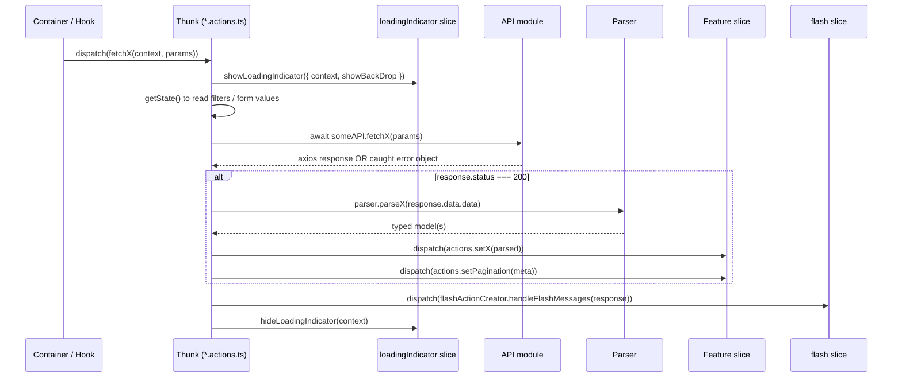

Real example — the config bootstrap thunk, referenced by the project rules as the template to copy:

```21:45:app/react_web/src/core/store/reducer/config/config.actions.ts
export const fetchSettings = (context: string) => {
  return async (dispatch: AppDispatch, getState: () => RootState) => {
    const rootState = getState();
    const configStates = rootState.config;
    if (configStates.isFetchingData) {
      return;
    }

    dispatch(
      loadingIndicatorActions.showLoadingIndicator({
        context: context,
        showBackDrop: true
      })
    );

    dispatch(configActions.setIsFetchingData(true));
    const response = await configAPI.fetchSettings();
    if (response.status === 200) {
      if (response?.data) {
        const currentUser = JSON.parse(response.data.currentUser);
        const parsedCompanySettings = settingsParser.parseCompanySettings({
```

### Slice conventions

```typescript
const initialState: FooStates = { /* ... */ };

export const fooSlice = createSlice({
  name: "fooSlice",
  initialState,
  reducers: {
    setBar: (state, action: PayloadAction<BarType>) => { state.bar = action.payload; },
    resetAll: () => initialState,
    reset: () => initialState
  }
});

export const fooActions = fooSlice.actions;
export default fooSlice.reducer;
```

| Prefix | Meaning |
|---|---|
| `set*` | assignment |
| `update*` | merge |
| `remove*` / `delete*` | removal |
| `reset` / `resetAll` | back to `initialState` (used on unmount, navigation, logout) |

**Slices store parsed models, never raw API JSON.** The main documented exception is `customDropdown`, which stores semi-parsed `{ id, label, paramValue, object }` shapes built inline.

### `extraReducers` — the narrow exception

Only ~8 workflow form slices use `extraReducers`, for cross-slice coordination when a workflow node is deleted or reset:

```146:160:app/react_web/src/core/store/reducer/modules/workflows/loopForm/loopForm.slice.ts
  extraReducers: (builder) => {
    // Clean up stateMap entry when a node is deleted
    workflowHelper.removeNodeFromStateMapMatcher(
      builder,
      workflowDetailActions.deleteNode.type
    );

    // Clear stateMap entry when edge removed and node is unconfigured (so defaults show on open)
    workflowHelper.removeNodeFromStateMapMatcher(
      builder,
      workflowDetailActions.clearStateMapEntryForNode.type
    );
```

### Selectors

Mostly inline: `useAppSelector((state) => state.checkoutItemsForm.checkoutTo)`. `createSelector` appears in only ~4 slices where derived computation is genuinely expensive. Cross-slice derived config lives in `modules/shared/actionForms/selectors.ts` as plain `(state: RootState) => ...` functions.

### Module folder layout

```
core/store/reducer/modules/<module>/
├── listingScreen/
│   ├── <module>ListingScreen.slice.ts
│   └── <module>ListingScreen.actions.ts
├── detailScreen/
│   ├── <module>DetailScreen.slice.ts
│   └── detailScreenTabs/<tab>/…
├── actions/<actionName>/           # one folder per dialog/mass action
│   ├── <action>.slice.ts
│   └── <action>.actions.ts
└── <module>Screen/                 # module-level UI state
```

There are **no** per-module `types/` or `selectors/` folders — state interfaces live in the slice file or in `~models` / `~data`.

---

## 10. API Layer: The Network Boundary

### `base.api.ts` — the only axios wrapper

Every request in the app goes through this file. It is small and load-bearing.

```9:37:app/react_web/src/core/repository/remote/api/base/base.api.ts
axios.defaults.headers.common["Content-Type"] = "application/json";
// TODO set timeout
axios.defaults.headers.common["react-web-app"] = "true";

axios.interceptors.request.use(
  (config) => {
    // ITSM CMDB embed: mount props (apiBaseUrl, X-Glpi-Csrf-Token, from_itsm_ticketing,
    // agent_email) are stored in requestContext by GraphBasedRelationshipTabEmbed and
    // merged here so every graph API call hits the GLPI proxy (same origin) instead of
    // AssetSonar directly. On native EZO, context is empty and this is a no-op.
    mergeGraphRequestConfig(config);

    // Rails CSRF cookie is EZO-only. ITSM uses X-Glpi-Csrf-Token from mount props above;
    // skip $.cookie here because GLPI pages do not expose the AssetSonar csrf_token cookie.
    if (!getGraphRequestContext().apiBaseUrl) {
      config.headers["X-CSRF-Token"] = $.cookie("csrf_token");
    }

    if (config.method === "get") {
      config.paramsSerializer = (params) => {
        return qs.stringify(params, { arrayFormat: "brackets", encode: false });
      };
    }
    return config;
  },
```

| Concern | Implementation | Why it matters |
|---|---|---|
| `react-web-app: true` header | axios default | Rails branches serializers, eager loading, and flash handling on this. **Bypassing `base.api.ts` changes backend behavior.** |
| CSRF | `X-CSRF-Token` from `$.cookie("csrf_token")` | Rails refreshes this cookie on every React JSON response |
| GET array params | `qs.stringify(..., { arrayFormat: "brackets", encode: false })` | Rails expects `key[]=a&key[]=b` |
| Auth | Session cookie, same origin | No bearer tokens |
| ITSM embed | `requestContext.ts` merges `apiBaseUrl`, `X-Glpi-Csrf-Token`, extra params | CMDB graph runs inside GLPI through a proxy |
| Response interceptor | **none** | No global response transformation; parsing is explicit |
| Retry / timeout | **none** | `// TODO set timeout` is still open |
| Cancellation | Not in base; a few CSV-download thunks use axios `CancelToken` | |

### API module shape

```1:16:app/react_web/src/core/repository/remote/api/config/config.api.ts
import { CORE_URLS } from "~config";
import { baseURLGenerator } from "~generator";

import api from "../base/base.api";

export const fetchSettings = async () => {
  const url = `${baseURLGenerator.generateBaseURL()}${
    CORE_URLS.companies_controller
  }${CORE_URLS.fetch_settings}`;

  try {
    return await api.get(url);
  } catch (err: any) {
    return err;
  }
};
```

Three rules visible here:

1. **URLs are composed, never literal.** `baseURLGenerator.generateBaseURL()` + `CORE_URLS.<controller>` + `CORE_URLS.json_format`.
2. **One exported async function per endpoint.**
3. **Errors are caught and returned, not thrown.**

### The error contract — read this carefully

```typescript
try {
  return await api.get(url);
} catch (err: any) {
  return err;   // the axios error object, NOT a thrown exception
}
```

Thunks therefore **must** branch on `response?.status`. There is no `try/catch` in the thunk layer, and an unhandled failure looks like `response.status === undefined` rather than a rejected promise. Forgetting the `?.` on `response?.status` is a common crash source.

### Base URL

```4:15:app/react_web/src/core/utils/generator/url/baseURL.generator.ts
export const generateBaseURL = (options: any = { withSubdomain: true }) => {
  const { apiBaseUrl } = getGraphRequestContext();
  if (apiBaseUrl) {
    return apiBaseUrl;
  }

  if (!options.withSubdomain) {
    return `${CORE_VALUES.HTTP_PROTOCOL}://${CORE_VALUES.DOMAIN}`;
  }
  const subdomain = window.location.hostname.split(".")[0];
  return `${CORE_VALUES.HTTP_PROTOCOL}://${subdomain}.${CORE_VALUES.DOMAIN}`;
};
```

Tenant subdomain aware on native EZO; overridden by the ITSM proxy origin when embedded.

### Known inconsistency

Several functions in `filters/filters.api.ts` pass relative paths (`/custom_filters.json`) straight to axios instead of using `baseURLGenerator`. They work because axios resolves against the page origin, but they are not the pattern to copy.

---

## 11. Parsers, ModelDataConverter, and Models

This is the layer that makes the Rails wire format safe to use in TypeScript.

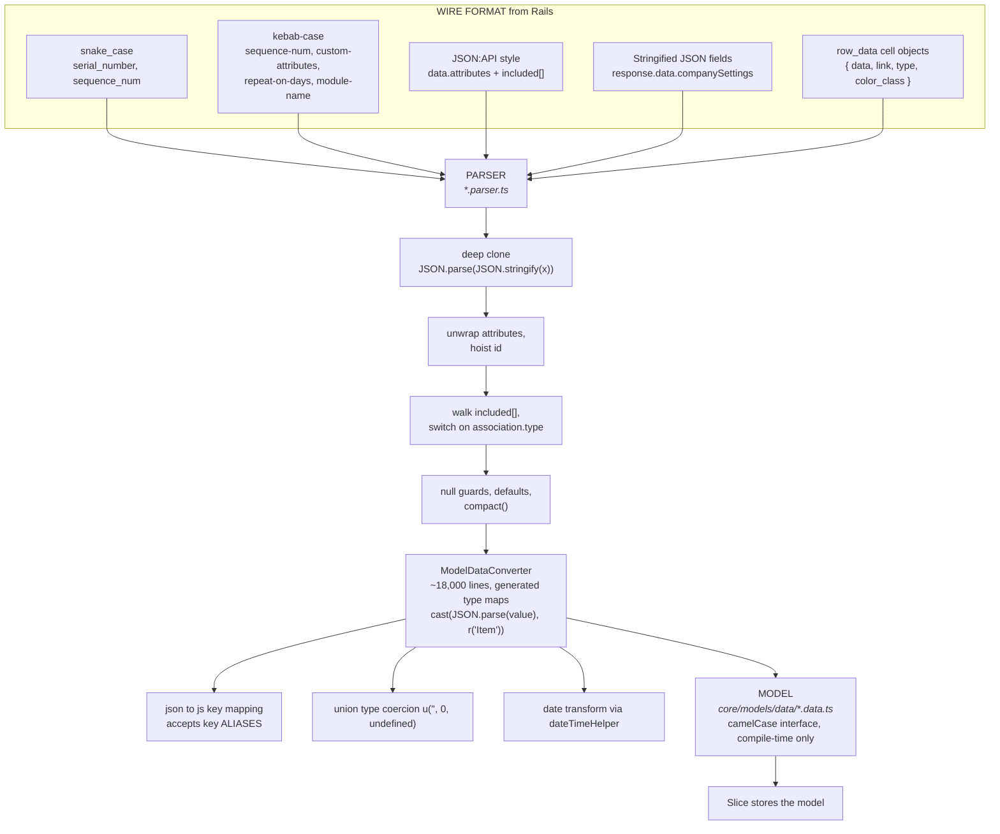

### Parser contract

No base class or interface. Plain functions, consistent signatures:

```typescript
export const parseX  = (raw: JsonObject): X | undefined => { /* ... */ }
export const parseXs = (raws: JsonObject[]): X[] => { /* ... */ }
```

**Parsers are called only from thunks** — never from API modules, never from components.

### Three parser tiers

**Tier 1 — thin converter wrapper (most common):**

```5:18:app/react_web/src/core/repository/parser/item/item.parser.ts
export const parseItems = (assetItems: JsonObject[]) => {
  const parsedAssetItems: AssetItem[] = [];
  assetItems.map((assetItem) => {
    const parsedAsset = parseItem(assetItem);
    if (parsedAsset) {
      parsedAssetItems.push(parsedAsset);
    }
  });
  return parsedAssetItems;
};

export const parseItem = (assetItem: JsonObject) => {
  return ModelDataConverter.toItem(JSON.stringify(assetItem));
};
```

**Tier 2 — JSON:API unwrapping + sideloaded associations:**

```47:75:app/react_web/src/core/repository/parser/assetItem/assetItem.parser.ts
export const parseAssetDetails = (assetItem: JsonObject) => {
  const assetItemDetail = JSON.parse(JSON.stringify(assetItem));
  const attributes = assetItemDetail.data?.attributes;
  const assetAssociations = assetItemDetail?.included;
  if (attributes) {
    attributes["id"] = assetItemDetail.data?.id ?? "-1";
    const parsedAsset = ModelDataConverter.toAssetItem(
      JSON.stringify(attributes)
    );
    // ...
    if (assetAssociations) {
      assetAssociations.forEach((association: any) => {
        if (association["attributes"]) {
          // ...
          if (association["type"] === "groups") {
            parsedAsset.group = ModelDataConverter.toGroup(/* ... */);
          }
          if (association["type"] === "vendors") {
            parsedAsset.vendor = ModelDataConverter.toVendor(/* ... */);
          }
```

**Tier 3 — hand-written mapping** for ad-hoc shapes with no generated type map (e.g. `checkoutValue.parser.ts`, which walks numeric string keys and maps `location_id` → `locationId` manually).

### `ModelDataConverter`

`core/utils/converter/modelData.converter.ts` is a ~18,000-line **generated type-map runtime** (quicktype-style). It, not the parsers, is where renaming, nesting, unions, and date coercion happen.

```831:833:app/react_web/src/core/utils/converter/modelData.converter.ts
  public static toItem(value: string): AssetItem {
    return cast(JSON.parse(value), r("Item"));
  }
```

```11340:11351:app/react_web/src/core/utils/converter/modelData.converter.ts
  Item: o(
    [
      { json: "id", js: "id", typ: u("", 0) },
      { json: "itam_hardware_id", js: "itamHardwareId", typ: u("", 0) },
      {
        json: ["sequence-num", "sequence_num"],
        js: "sequenceNum",
        typ: u("", 0)
      },
      { json: "group_id", js: "groupId", typ: u(0, undefined) },
      { json: "location_id", js: "locationId", typ: u("", 0, undefined) },
```

Note `json: ["sequence-num", "sequence_num"]` — the type map accepts **key aliases**, absorbing the backend's inconsistent casing. `cast` is inbound (wire → camelCase); `uncast` is outbound and rarely used from React.

Date coercion:

```45:56:app/react_web/src/core/utils/converter/utilities.ts
  function transformDate(val: any): any {
    if (val === null) {
      return null;
    }
    const d = dateTimeHelper.getNewDate(val);
    if (isNaN(d.valueOf())) {
      return invalidValue("Date", val);
    }
    return d;
  }
```

### Models

`core/models/` holds compile-time types only — `interface`s, not classes, with no runtime instantiation and no methods.

```
core/models/
├── index.ts     # re-exports all three
├── data/        # <name>.data.ts  domain interfaces, camelCase
├── enums/       # <name>.enum.ts  canonical enum location, alias ~enums
└── props/       # <name>.props.ts component/dialog prop contracts
```

Shared dialog contracts in `models/props/` are what make the action-dialog system pluggable:

```32:45:app/react_web/src/core/models/props/shared/actions/actionDialog.ts
export interface ActionDialogsInterface {
  /**
   * @context Context of the screen
   */
  context: string;
  /**
   * @action Selected action
   */
  action:
    | AssetItemActions
    | TaskActions
    | DocumentActions
```

### Dead code to avoid

- `core/parsers/` (`TaskParser.ts` + `Index.ts`) — orphaned legacy files with no importers anywhere in `app/react_web/`. The maintained version is `core/repository/parser/task/task.parser.ts`, exported as `taskParser` from `~parsers`.
- `core/enums/memberActions.enum.ts` — the only file in `core/enums/`. New enums go in `core/models/enums/`.

---

## 12. i18n and Tenant Custom Labels

Two independent systems produce user-facing text, and both matter.

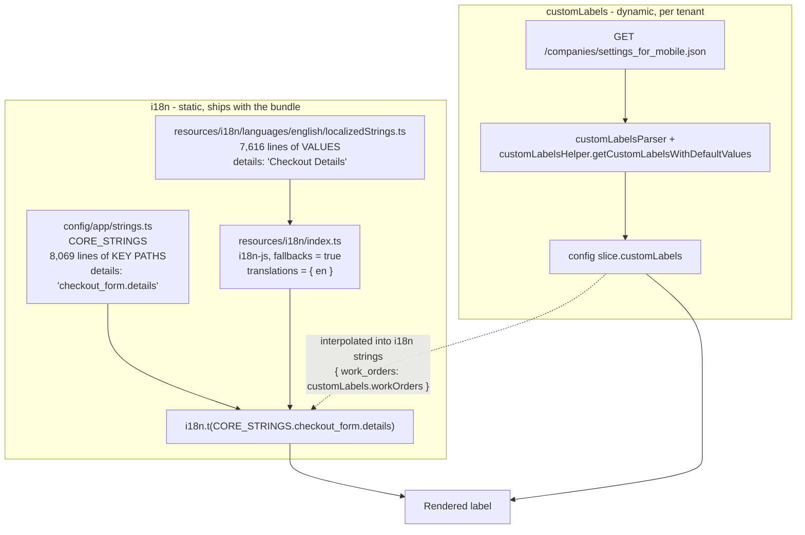

### The two-file key/value split

| File | Holds | Example |
|---|---|---|
| `config/app/strings.ts` → `CORE_STRINGS` | dot-path **keys** | `addresses_selected_count: "shared.defaults.addresses_selected_count"` |
| `resources/i18n/languages/english/localizedStrings.ts` → `en` | English **values** | `addresses_selected_count: "%{count} address(es) selected."` |

Usage:

```typescript
i18n.t(CORE_STRINGS.shared.defaults.addresses_selected_count, { count: selectedCount })
```

**Both files must be updated together.** The `CORE_STRINGS` indirection exists so a typo becomes a TypeScript error rather than a silently missing translation at runtime.

### Setup

```1:10:app/react_web/src/resources/i18n/index.ts
import i18n from "i18n-js";

import { en } from "./languages/index";

i18n.fallbacks = true;
i18n.translations = { en };

const t = i18n.t.bind(i18n);

export { i18n, t };
```

| Fact | Detail |
|---|---|
| Library | `i18n-js` 3.8.0 — **not** i18next or react-i18next |
| Access | `import { i18n } from "~i18n"` then `i18n.t(...)`. **No `useTranslation` hook.** |
| Languages | **English only.** `i18n.translations = { en }` is hardcoded; no runtime locale switching |
| Interpolation | i18n-js `%{variable}` syntax |
| Pluralization | **Not** i18n-js plural rules. Explicit `module_labels.<x>.singular` / `.plural` keys selected in code |
| Rails locales | `config/locales/*.yml` is a **completely separate tree** for ERB views, mailers, and server messages. No sync, no shared files |

### `module_labels`

Standardized singular/plural resource names, the i18n defaults that `customLabels` can override:

```1933:1945:app/react_web/src/resources/i18n/languages/english/localizedStrings.ts
  module_labels: {
    missed_rentals: {
      singular: "Missed Rental",
      plural: "Missed Rentals"
    },
    fixed_asset: {
      singular: "Asset",
      plural: "Assets"
    },
    work_order: {
      singular: "Work Order",
      plural: "Work Orders"
    },
```

### i18n vs customLabels — when to use which

| Situation | Use |
|---|---|
| Static UI copy: buttons, dialog titles, validation, empty states | `i18n.t(CORE_STRINGS...)` |
| A module/resource name a tenant can rename ("Work Order" → "Job") | `customLabels.workOrder` from the `config` slice |
| A sentence containing a renameable module name | `i18n.t(key, { work_orders: customLabels.workOrders })` |

### Enforcement

There is **no ESLint rule** blocking hardcoded strings — compliance is convention plus the PR checklist in `.github/pull_request_template.md`. Violations exist in the codebase today (for example a literal `"Custom Fields"` section label in `checkoutItemsFormData.generator.ts`, and literal operator labels like `"Equals"` / `"Is Null"` in `customFilterData.generator.ts`). Do not treat those as precedent.

---

## 13. Cross-Cutting Infrastructure

Four global systems every module plugs into.

```mermaid
flowchart TB
    subgraph CTX["1 - CONTEXT IDs"]
        C1["core/utils/context/context.ts<br/>CONTEXT: ~360 string IDs<br/>e.g. checkout_items_dialog"]
        C2["Scopes loading indicators,<br/>config fetch, shared component identity.<br/>NOT React Context."]
        C1 --> C2
    end
    subgraph LOAD["2 - LOADING"]
        L1["loadingIndicator slice<br/>keyed by context, REFERENCE COUNTED"]
        L2["show: count++ / hide: count--, delete at 0<br/>Concurrent fetches on one screen work correctly"]
        L3["container LoadingIndicator reads<br/>state.loadingIndicator.loadingIndicators[context]"]
        L1 --> L2 --> L3
    end
    subgraph FL["3 - FLASH"]
        F1["flash slice: success, error, alert, info, note"]
        F2["flashActionCreator.handleFlashMessages(response)<br/>reads response.data.flash_messages"]
        F3["FlashContainer mounted once in App.tsx"]
        F2 --> F1 --> F3
    end
    subgraph CF["4 - CONFIG + FILTERS"]
        G1["config slice: currentUser, permissions,<br/>companySettings, customLabels, sidebarMenuData"]
        G2["filters slice: resourceFilters, filtersApplied,<br/>tempFilters, persistedFilters"]
    end
```

### Loading — reference counted by context

```21:45:app/react_web/src/core/store/reducer/loadingIndicator/loadingIndicator.slice.ts
export const loadingIndicatorSlice = createSlice({
  name: "loadingIndicator",
  initialState: initialState,
  reducers: {
    resetAll: (state) => initialState,
    showLoadingIndicator(state, action: PayloadAction<LoadingIndicatorProps>) {
      const loadingIndicator = action.payload;
      const { context, showBackDrop, hideBackground, fixedOverlay } =
        loadingIndicator;
      const loadingIndicatorObject = {
        count: state.loadingIndicators[context]
          ? state.loadingIndicators[context].count + 1
          : 1,
        showBackDrop: showBackDrop ?? false,
        hideBackground: hideBackground ?? false,
        fixedOverlay: fixedOverlay ?? false
      };

      state.loadingIndicators[context] = loadingIndicatorObject;
    },
    hideLoadingIndicator(state, action: PayloadAction<string>) {
      const context = action.payload;
      if (state.loadingIndicators[context]) {
        state.loadingIndicators[context].count--;
```

Reference counting is why every `showLoadingIndicator` **must** have a matching `hideLoadingIndicator`, including on the error path. An unbalanced pair leaves a permanent spinner.

Loading state is **dual-track**: this global context-keyed indicator, plus optional per-slice flags (`isFetchingData`, `displayLoader`, `filtersLoaded`).

### Flash — errors do not live in slices

```12:33:app/react_web/src/core/store/reducer/flash/flash.actions.ts
export const handleFlashMessages = (
  response?: any,
  isModalBanner: boolean = false
) => {
  return async (dispatch: AppDispatch) => {
    if (handleApiFlash(response)) {
      return;
    }
    if (getGraphRequestContext().apiBaseUrl) {
      return;
    }
    if (response?.status === 200 || response?.status === 201) {
      dispatch(handleFlashResponse(isModalBanner, response as AxiosResponse));
    } else {
      dispatch(handleAxiosErrorResponse(isModalBanner, response as AxiosError));
    }
  };
};
```

There is **no standard `error: string | null` field on slices.** All user-visible errors flow through `flash`. Success responses can still carry warnings in `flash_messages`, which is why `handleFlashMessages` is called on *every* response, not just failures.

Recognized flash keys: `notice`, `notice_title`, `notice_actions`, `error`, `error_title`, `error_actions`, `alert`, `alert_title`, `alert_heading`, `info`, `info_title`, `message`.

### Other non-module reducers

| Reducer | Purpose |
|---|---|
| `config` | App bootstrap: currentUser, permissions, companySettings, customLabels, sidebar, notifications |
| `filters` | Global filter state: `resourceFilters`, `filtersApplied`, `tempFilters` (draft while pane open), `persistedFilters` |
| `tabs` | Per-tab slices for detail-page tabs (services, work logs, linked inventory, CMDB graph) |
| `shared` | Reusable feature slices used by several modules (quick item center, group selector, agreement form) |
| `customDropdown` | Paginated async dropdown cache keyed by dropdown id: `{ options, isLoading, hasNextPage, currentPage }` |
| `globalSearch` | Navbar live search results and facets |
| `listViewPreference` / `listViewPreferenceII` | Column picker (legacy and web/mobile-split v2) |
| `kpiPreference` | Overview KPI pin preferences |
| `picklist` | Work-order assignee/approver/reviewer picklists |

### Utils

| Folder | Purpose |
|---|---|
| `helpers/` | `generalHelper`, `filterHelper`, `itemsHelper`, `customLabelsHelper`, `dateTimeHelper`, `sidebarHelper`, `navigationHelper`, `workflowHelper`, `airbrakeHelper`, `graphBasedRelationshipHelper` |
| `converter/` | `ModelDataConverter` + request/response shape converters |
| `generator/` | 338 descriptor builders (see [§8](#8-generators-declarative-ui-descriptors)) |
| `context/` | `CONTEXT` string-ID registry — **not React Context** |
| `validators/` | Email, URL, webhook JSON schema, software patch executable |
| `formatters/` | Workflow expression parse/evaluate/format pipeline |
| `filters/` | Boolean logic engine for nested AND/OR filter groups (unit tested) |
| `autocomplete/` | CodeMirror completion for workflow expressions |
| `blogsLink/` | Static help/blog URLs |

---

## 14. Backend Contract

The part of Rails the frontend actually depends on. Full backend detail belongs in `.cursor/rules/rails-backend.mdc`.

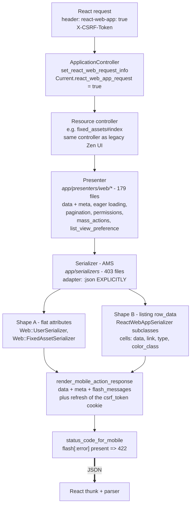

### The envelope

```242:253:app/controllers/application_controller.rb
  def render_mobile_action_response(options = {})
    cookies[:csrf_token] = form_authenticity_token if react_web_app?
    # ...
    render json: { flash_messages: flash.to_hash, meta: options[:meta], data: options[:data] }, status: status_code_for_mobile(options[:status])
  end
```

```json
{
  "data": { } | [ ] | null,
  "meta": {
    "current_page": 1, "total_pages": 5, "per_page": 25, "total_entries": 120,
    "permissions": { },
    "mass_actions": [ ],
    "list_view_preference": { "selected_columns": [ ], "rows_to_display": 25 }
  },
  "flash_messages": { "notice_title": "...", "error": ["..."] }
}
```

### Envelope shapes the frontend must handle

There is **no single universal shape**. Parsers exist precisely because of this.

| Shape | Where | Frontend handling |
|---|---|---|
| **A — listing** `{ data: [...], meta: {...} }` | Most listings | `parseX(response.data.data)` + `setPagination(response.data.meta)` |
| **B — JSON:API detail** `{ data: { attributes, id }, included: [...] }` | Asset/task detail | `parseAssetDetails` unwraps `attributes`, walks `included` |
| **C — stringified fields** `{ companySettings: "<json string>" }` | `settings_for_mobile.json` | `JSON.parse(response.data.companySettings)` before parsing |
| **D — flat action/form hash** | Form loads, checkout | Read snake_case keys directly off `response.data` |
| **E — `row_data` listing rows** | Purchase orders, tasks, services | `listingRowParser.parseListingRows` |
| **F — filter picker** keyed groups | Filter side pane | `parseFilterData` skips `meta`/`flash_messages`/`status`/`next_page` |

### Key casing — the core reason parsers exist

| Direction | Convention |
|---|---|
| **Rails → React** | **snake_case** (dominant) plus **kebab-case** where serializers use `key:` overrides. Converted to camelCase by `ModelDataConverter`. |
| **React → Rails** | **Manual snake_case.** No automatic reverse conversion. Thunks and API modules send `{ purchase_order: params }`, `sequence_nums`, etc. |

There is **no** global AMS camelCase key transform. Kebab-case appears because many serializers were built for the mobile app first:

```1:10:app/serializers/location_serializer.rb
class LocationSerializer < BaseSerializer
  attributes :name, :lati, :longi
  attribute :identification_number, key: 'identification-number'
  attribute :sequence_num, key: 'sequence-num'
  attribute :id, if: :react_app?
  attribute :street1, key: 'address-line-1', if: :react_app?
  attribute :items, if: :react_web_app?
```

### The adapter trap

The global initializer sets JSON:API as the default:

```1:5:config/initializers/active_model_serializer.rb
ActiveSupport.on_load(:action_controller) do
  ActiveModelSerializers.config.adapter = :json_api
  ActiveModelSerializers.config.serializer_lookup_enabled = false
  ActiveModelSerializers.logger = ActiveSupport::TaggedLogging.new(ActiveSupport::Logger.new('/dev/null'))
end
```

Every React path **explicitly overrides this to `:json`**:

```7:14:app/presenters/web/base_presenter.rb
    def serialize_resource(resource, **options)
      fields = options.delete(:fields)
      ActiveModel::SerializableResource.new(
        resource,
        adapter: :json,
        view_context:,
        **options
      ).as_json(fields:)
    end
```

If you add a serialization call without `adapter: :json`, you silently get a JSON:API envelope and the frontend parser breaks.

### Listing row cells

Listing serializers that inherit `ReactWebAppSerializer` return a `row_data` hash of cell objects rather than flat attributes:

```37:46:app/serializers/purchase_order_serializer.rb
  def attributes(*args)
    row_data = super
    custom_attributes = row_data.delete(:custom_attributes_values)
    row_data.merge!(custom_attributes) if custom_attributes.present?
    {
      id: purchase_order.id,
      sequence_num: purchase_order.sequence_num,
      state: purchase_order.state,
      row_data:
    }
  end
```

Each cell is `{ data, link?, type?, color_class?, truncate_length? }`, consumed by `listingRow.parser.ts`. **Check which shape a module uses** — flat records (members, assets) and `row_data` rows (POs, tasks) are parsed differently.

### `react_web_app?` — behavior forks on the header

```1023:1025:app/controllers/application_controller.rb
  def set_react_web_request_info
    Current.react_web_app_request = request.headers["HTTP_REACT_WEB_APP"] == "true"
  end
```

`BaseSerializer#react_web_app?` gates conditional attributes, association inclusion (`include_assocation?`, which prevents N+1 when associations aren't requested), and flash promotion. **This is the strongest reason never to bypass `base.api.ts`** — a raw axios call gets a different payload from the same endpoint.

### Status codes

```298:302:app/controllers/application_controller.rb
  def status_code_for_mobile(status)
    return status if status.present?
    flash[:error].blank? ? :ok : :unprocessable_entity
  end
```

A validation failure returns **422 with a structured body**. The thunk's `if (response?.status === 200)` guard skips parsing, and `handleFlashMessages` surfaces the error. That is the intended behavior.

### What is *not* part of the React path

| Thing | Status |
|---|---|
| `*.json.jbuilder` views | **0 in the repo** |
| `*.json.erb` views | 4, calendar events only, not React |
| Draper decorators (`app/decorators/`, 34 files) | Mostly HTML views and legacy jQuery JSON. A few serializers call `.decorate` for display strings, but decorators are **not** the React pipeline. If JSON looks wrong, trace Controller → Presenter → Serializer. |
| `app/controllers/api/v2/` + `app/serializers/api/v2/` (50 serializers) | A **separate external REST API**: token auth, Swagger validation, `metadata` pagination key, versioned `V20240101` serializers. React screens do not use it. Do not conflate the two contracts. |

### Form-data services

`app/services/workflows/form_data/` (5 services) prefill React dialogs from workflow node configuration, dispatched by `WorkflowControllerFunctions#convert_workflow_action_form_data`:

```14:30:app/services/workflows/form_data/checkout_asset.rb
      def call
        checkout_values = @form_data['checkout_values'] || {}
        location_custody = to_bool(@form_data['custodian_location_toggle'])
        data_hash = {
          comments: checkout_values['comments'],
          checkout_indefinite: to_bool(@form_data['checkout_forever']),
          checkout_to_type: location_custody ? location_checkout_type : member_checkout_type,
          dialog_title: I18n.t('workflows.shared.fixed_asset_checkout_dialog_title'),
          # ...
        }
        set_location!(data_hash, checkout_values['location_id'], location_custody)
        set_checkout_to!(data_hash, @form_data.dig('user', 'id'), location_custody)
        data_hash
      end
```

Dropdown fields here use `{ id, label, paramValue }` — `paramValue` is intentionally camelCase to match the React dropdown component contract. This is a deliberate exception to the snake_case wire convention.

Note that `app/services/checkout_service.rb` is **business logic**, not a JSON builder. It performs the checkout and sets `flash[:notice]` / `flash[:error]`; the controller then calls `render_mobile_action_response`.

---

## 15. End-to-End Worked Example: Asset Checkout

Every layer, one real user action.

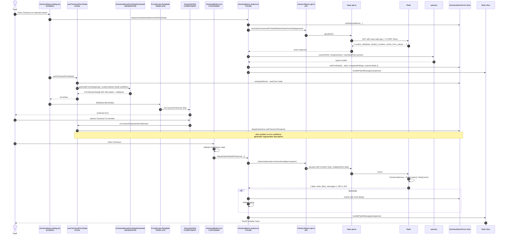

### Files touched, in order

| # | Layer | File |
|---:|---|---|
| 1 | Screen | `core/screens/items/checkout/checkoutItems.dialog.tsx` |
| 2 | Hook | `core/hooks/modules/items/checkoutFormData.ts` |
| 3 | Generator | `core/utils/generator/items/checkoutItemsFormData.generator.ts` |
| 4 | i18n | `config/app/strings.ts` + `resources/i18n/languages/english/localizedStrings.ts` |
| 5 | Template | `core/templates/formScreenTemplate/formScreen.template.tsx` |
| 6 | Component | `core/components/organisms/dynamicField/dynamicField.tsx` |
| 7 | Container | `core/containers/items/actions/checkout/checkoutButton.tsx` |
| 8 | Slice | `core/store/reducer/modules/item/actions/checkout/checkoutItems.slice.ts` |
| 9 | Thunk | `core/store/reducer/modules/item/actions/checkout/checkoutItems.actions.ts` |
| 10 | API | `core/repository/remote/api/items/checkoutItems.api.ts` |
| 11 | HTTP | `core/repository/remote/api/base/base.api.ts` |
| 12 | Parsers | `core/repository/parser/{item,customField,dropdownItem,keyValuePairs}/` |
| 13 | Converter | `core/utils/converter/modelData.converter.ts` |
| 14 | Rails | `app/services/checkout_service.rb`, `app/services/workflows/form_data/checkout_asset.rb` |
| 15 | Flash | `core/store/reducer/flash/flash.actions.ts` |

The dialog itself stays declarative — it names the template, the title, and where the submit button comes from:

```312:333:app/react_web/src/core/screens/items/checkout/checkoutItems.dialog.tsx
  return (
    <>
      <FormScreenTemplate
        title={getModalTitle()}
        modalId={FormModalTypes.CheckoutItems}
        context={context}
        formType="action"
        fieldData={showAgreementForm ? [] : formData}
        showModal={true}
        onModalHeaderIconClick={handleOnAgreementFormCancelBtnPressed}
        renderSubmitButton={renderSubmitButton}
        renderBackButton={showAgreementForm}
        onBackButtonPress={
          showAgreementForm ? handleOnAgreementFormCancelBtnPressed : undefined
        }
        onCancelBtnPressed={
          showAgreementForm
            ? handleOnAgreementFormCancelBtnPressed
            : handleOnCancelBtnPressed
        }
        isLargeModal={itemType == ResourceTypes.Inventory}
      >
```

---

## 16. Build System and Product Variants

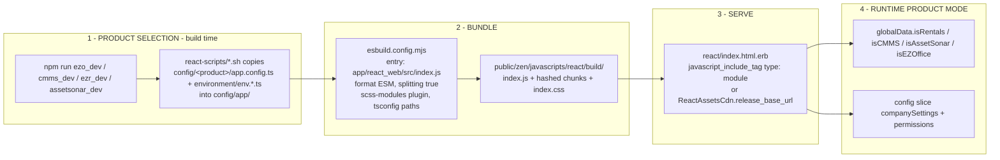

### Commands

| Command | Effect |
|---|---|
| `npm run ezo_dev` | Copy EZO product config + development env into `config/app/` |
| `npm run start` | Clean + `NODE_ENV=development` esbuild **watch** |
| `npm run serve` | Dev server with livereload on port 35729 |
| `npm run build` | Clean + `NODE_ENV=production` esbuild + brotli/gzip siblings |
| `npm run build:cmdb-embed` | ITSM/GLPI embed IIFE bundle → `public/cmdb-embed-dist/` |

Typical dev loop: `npm run ezo_dev && npm run start`.

### esbuild configuration

| Setting | Value |
|---|---|
| Entry | `app/react_web/src/index.js` |
| Output | `public/zen/javascripts/react/build/` |
| Format | ESM, loaded with `type: "module"` |
| Splitting | `true` → `index.js` + hashed lazy chunks |
| Sourcemaps | unless `REACT_SOURCEMAP === "false"` |
| Minify | `NODE_ENV === "production"` |
| CSS | `esbuild-scss-modules-plugin` |
| Env define | `process.env.NODE_ENV` only |
| Aliases | resolved from root `tsconfig.json` `paths` |

### Rails reference

```10:11:app/views/react/index.html.erb
    <%= javascript_include_tag '/zen/javascripts/react/build/index', type: 'module' %>
    <%= stylesheet_link_tag '/zen/javascripts/react/build/index' %>
```

### Product config is only colors and labels

```3:6:app/react_web/src/config/ezo/app.config.ts
import { APP_COLORS as CORE_COLORS } from "../ezo/colors";
import { APP_LABELS as CORE_LABELS } from "../ezo/labels";
export { CORE_COLORS, CORE_LABELS };
```

`config/app/` is a **copied, generated directory** — edit `config/ezo/`, `config/cmms/`, `config/ezr/`, or `config/assetsonar/`, never `config/app/app.config.ts` or `config/app/env.ts`. (`config/app/urls.ts`, `strings.ts`, and `values.ts` are shared source files and *are* edited directly.)

### Three build systems coexist

| System | Scope |
|---|---|
| **esbuild** | All new React code |
| **Webpacker 5.4.4** | Legacy packs in `app/javascript` — `zen/webpacked_main_layout` is still loaded by the React layout |
| **Sass CLI** | `public/zen/stylesheets/react_web/*.scss` → CSS, compiled separately from esbuild |

### ITSM/CMDB embed

`app/react_web/src/embed/` is a second entry point for embedding the CMDB relationship graph inside GLPI/ITSM ticket tabs.

| | Main app | Embed |
|---|---|---|
| Entry | `index.js` → `#react_root` | `cmdbGraphTicketMount.tsx` → `window.mountTicketCmdbGraph`, host container |
| Router | `createBrowserRouter` | `MemoryRouter` (no host router) |
| Shell | Full `ListingLayout` | Graph component only |
| Auth | Rails CSRF cookie | `X-Glpi-Csrf-Token` + `from_itsm_ticketing` via `requestContext.ts` |
| Output | ESM in `public/zen/javascripts/react/build/` | IIFE in `public/cmdb-embed-dist/` |

### Testing

- **Runner:** Jest + ts-jest, `jsdom`, config in `jest.config.js`. No `test` script — run `npx jest <path>`.
- **Aliases:** `moduleNameMapper` derived from `tsconfig.json` paths via `pathsToModuleNameMapper`; `~models` is stubbed by `test/jest/__mocks__/models.ts`.
- **Placement:** colocated `*.test.ts(x)` next to source (~25 files).
- **Style:** predominantly logic tests — parsers, slices, filter logic, permission generators. Very little component rendering.

---

## 17. Adding a New Module: Checklist

Follow `.cursor/rules/react-module-scaffolding.mdc`. Substitute `<module>` (camelCase) and `<Module>` (PascalCase).

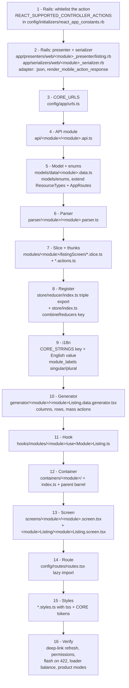

**Two steps most often missed:**

- **Step 1** — a client route without a whitelisted Rails action means hard refresh and deep links fall back to the legacy page.
- **Step 8** — a slice that is not registered in **both** `store/reducer/index.ts` and `store/index.ts` makes `useAppSelector` return `undefined` with no error.

---

## 18. Anti-Patterns and Gotchas

### Hard rules

| Do not | Why | Instead |
|---|---|---|
| Call `axios` directly from a component, container, hook, or screen | Loses `react-web-app` header (backend returns a **different payload**), CSRF, and array serialization | Add a function to a `*.api.ts` module, call it from a thunk |
| Store raw API JSON in a slice | Snake/kebab keys leak into components; no types; dates stay strings | Parse first |
| Add `try/catch` around an API module call in a thunk | API modules already catch and **return** the error; the `catch` is dead code | Branch on `response?.status` |
| Write `response.status` without `?.` | Caught axios errors may have no `status` | `response?.status === 200` |
| `showLoadingIndicator` without a matching `hide` on every path | Reference count never reaches 0 → permanent spinner | Hide in the same thunk, including the error path |
| Skip `handleFlashMessages` on success | Rails puts warnings in `flash_messages` on 200 too | Always call it, on every response |
| Look up state by the slice's `name` | Slice `name` is a DevTools prefix, often different from the store key | Read `store/index.ts` |
| Add an AMS serialization call without `adapter: :json` | Global default is `:json_api`; you silently get the wrong envelope | Pass `adapter: :json` |
| Hardcode a user-facing string | Breaks i18n and tenant labels | `i18n.t(CORE_STRINGS...)` and `customLabels` |
| Hardcode a module name like "Work Order" | Tenants rename modules | `customLabels.workOrder` |
| Edit `public/zen/javascripts/react/build/` or generated `*.css` / `*.css.map` | Generated artifacts | Edit source, rebuild |
| Edit `config/app/app.config.ts` or `config/app/env.ts` | Overwritten by the product copy script | Edit `config/<product>/` |
| Add an enum to `core/enums/` | Legacy folder with one file | `core/models/enums/` |
| Add a parser to `core/parsers/` | Dead legacy folder, no importers | `core/repository/parser/` |
| Use untyped `useDispatch` / `useSelector` | Loses `RootState` typing | `useAppDispatch` / `useAppSelector` from `~hooks` |
| Use inline styles in a new component | Not themeable, not tokenized | adjacent `*.styles.ts` with `tss` |

### Traps worth knowing

| Trap | Detail |
|---|---|
| **Store key vs slice name** | `checkoutItemsFormSlice` has `name: "checkoutFormScreenSlice"` but lives at `state.checkoutItemsForm`. |
| **No `createAsyncThunk`** | Do not introduce it; 333 slices use hand-written thunks and the loading/flash template. Mixing patterns fragments error handling. |
| **No response interceptor** | Nothing transforms responses globally. Every shape is handled explicitly in a parser. |
| **No retry, no timeout** | A hung request hangs the loader forever. `// TODO set timeout` is still open in `base.api.ts`. |
| **Flat store, ~340 reducers at boot** | No lazy reducer injection. Every new module grows the initial bundle. |
| **Logout wipes everything** | `auth/logout` resets `RootState` to `{}`. Any slice assuming a populated `initialState` after logout will crash. |
| **`config` is async** | `config.companySettings` is `undefined` on first render. Guard permission-dependent UI. |
| **Two `layouts` folders** | `core/layouts/` is the error boundary; `src/layouts/` is the navbar/sidebar shell. |
| **Two loading indicators** | An atom (`displayLoadingIndicator` boolean) and a container (context-keyed, Redux). Templates use both. |
| **`utils/context/` is not React Context** | It is a registry of ~360 string IDs used to scope loaders. |
| **API v2 is a different contract** | `app/controllers/api/v2/` + 50 versioned serializers, token auth, `metadata` pagination. Not the React path. |
| **Draper is mostly not in the React path** | If JSON looks wrong, trace Controller → Presenter → Serializer. |
| **Outbound casing is manual** | Nothing converts camelCase back to snake_case. Request bodies must be written in snake_case by hand. |
| **English only** | `i18n.translations = { en }` is hardcoded and there is no locale switching. Rails `config/locales` is a separate tree. |

---

## 19. Reference Tables

### TypeScript path aliases (complete, from root `tsconfig.json`)

| Alias | Target |
|---|---|
| `~config` | `app/react_web/src/config/app` |
| `~routes` | `app/react_web/src/config/routes/routes.tsx` |
| `~hooks` | `app/react_web/src/core/hooks` |
| `~api`, `~api/*` | `app/react_web/src/core/repository/remote/api` |
| `~parsers`, `~parsers/*` | `app/react_web/src/core/repository/parser` |
| `~paramBuilders` | `app/react_web/src/core/repository/paramBuilder` |
| `~store` | `app/react_web/src/core/store` |
| `~reducers` | `app/react_web/src/core/store/reducer` |
| `~utils`, `~utils/*` | `app/react_web/src/core/utils` |
| `~generator` | `app/react_web/src/core/utils/generator` |
| `~helpers`, `~helpers/*` | `app/react_web/src/core/utils/helpers` |
| `~models` | `app/react_web/src/core/models` |
| `~data`, `~data/*` | `app/react_web/src/core/models/data` |
| `~enums` | `app/react_web/src/core/models/enums` |
| `~screens`, `~screens/*` | `app/react_web/src/core/screens` |
| `~containers`, `~containers/*` | `app/react_web/src/core/containers` |
| `~components` | `app/react_web/src/core/components` |
| `~atoms` | `app/react_web/src/core/components/atoms` |
| `~molecules` | `app/react_web/src/core/components/molecules` |
| `~templates` | `app/react_web/src/core/templates` |
| `~layouts` | `app/react_web/src/core/layouts` |
| `~tss` | `app/react_web/src/core/tss/tss` |
| `~i18n` | `app/react_web/src/resources/i18n` |
| `~images` | `app/react_web/src/resources/images` |
| `~resources` | `app/react_web/src/resources` |
| `~interfaces` | `app/react_web/src/resources/interfaces` |
| `~types` | `app/react_web/src/resources/types` |
| `~constants`, `~constants/*` | `app/react_web/src/resources/values/constants` |

### File naming conventions

| Artifact | Pattern | Example |
|---|---|---|
| Screen | `name.screen.tsx` | `itemsListing.screen.tsx` |
| Dialog | `name.dialog.tsx` | `checkoutItems.dialog.tsx` |
| Template | `name.template.tsx` | `formScreen.template.tsx` |
| Container | camelCase + role | `topSectionContainer.tsx`, `checkoutButton.tsx` |
| Component | `folder/folder.tsx` | `customButton/customButton.tsx` |
| Hook | `useName.ts` | `useItemsListing.ts` |
| Generator | `name.generator.ts(x)`, `name.data.generator.tsx` | `checkoutItemsFormData.generator.ts` |
| Slice | `name.slice.ts` | `checkoutItems.slice.ts` |
| Thunks | `name.actions.ts` | `checkoutItems.actions.ts` |
| API module | `name.api.ts` | `items.api.ts` |
| Parser | `name.parser.ts` | `assetItem.parser.ts` |
| Data model | `name.data.ts` | `assetItem.data.ts` |
| Enum | `name.enum.ts` | `appRoutes.enums.ts` |
| Props | `name.props.ts` | `dynamicField.props.ts` |
| Styles | `name.styles.ts` | `itemsListing.screen.styles.ts` |
| Icon | `name.svg.tsx` | in `resources/images/icons/svg/` |

### Redux export triple

| Export | Source | Purpose |
|---|---|---|
| `<feature>Reducer` | slice default export | registered in `store/index.ts` |
| `<feature>Actions` | `slice.actions` | synchronous reducers |
| `<feature>ActionCreator` | `import * as` from `*.actions.ts` | async thunks |

### Key config constants

| Constant | Source | Contents |
|---|---|---|
| `CORE_URLS` | `config/app/urls.ts` | Rails controller paths, format suffixes (`json_format`, `csv_format`) |
| `CORE_STRINGS` | `config/app/strings.ts` | i18n key **paths** (not text) |
| `CORE_VALUES` | `config/app/values.ts` + `env.ts` | Domain, protocol, app name, Airbrake IDs, limits |
| `CORE_COLORS` / `CORE_LABELS` | `config/<product>/` copied into `config/app/app.config.ts` | Product theme and default labels |
| `CORE_IMAGES` | `~images` → `resources/images/icons` | 400+ SVG React components |
| `CONTEXT` | `core/utils/context/context.ts` | ~360 loader/screen scope IDs |
| `globalData` | injected by `layouts/zen/react.html.erb` | Product flags, date formats, current user id |

### Key library versions

| Library | Version |
|---|---|
| React | 18.2.0 |
| react-router-dom | 6.4.3 |
| @reduxjs/toolkit | 1.8.4 |
| axios | 0.21.4 |
| i18n-js | 3.8.0 |
| TypeScript | 4.8.4 |
| esbuild | 0.17.18 |
| MUI | 6.4.1 |
| Zendesk Garden | 9.4.x |
| Webpacker (legacy) | 5.4.4 |
| Rails / Ruby | 6.1.7.3 / 3.1.4 |

---

## 20. Pynwheel Connect (Next.js) — Infrastructure Updates

This section is the running log the implementation keeps against this document. Everything above
describes the React 18 SPA embedded in the ezofficeinventory Rails monolith; the entries below
record what was missing, ambiguous, or different when that architecture was applied to the
**Pynwheel Connect** Next.js app in `pyn-connect-web/`, which reads the **existing Pynwheel CMS
(Rails) backend in this repository**.

### September 17, 2026 — Infrastructure Update: where the new frontend lives

**What was missing:**
The document describes a React 18 SPA mounted by Rails at `app/react_web/src` and never states
where a **Next.js** app for this product lives, how it is served, or how it relates to the
existing CMS. The Pynwheel Connect scope calls for Next.js screens against this repository's
Rails app, and this repository contained no JavaScript frontend at all (no `package.json`,
no `app/javascript`, no `app/react_web`).

**What was found/implemented:**
A standalone Next.js 15 (App Router, React 19, TypeScript) application at
`pyn-connect-web/`, run separately on port 3001 and pointed at the Rails app through
`PYNWHEEL_CMS_URL`. It is **not** mounted by Rails: there is no `react_supported_controller_action?`
gate, no `globalData` handoff, no `react/index.html.erb` shell, and no
`/companies/settings_for_mobile.json` bootstrap — all four are ezofficeinventory-specific and have
no counterpart in the Pynwheel CMS. The equivalent of the two-stage configuration (§4) is a single
stage: the signed-in user arrives in `meta.current_user` on every listing response.

**Reference:**
`pyn-connect-web/README.md`, `pyn-connect-web/src/app/layout.tsx`,
`pyn-connect-web/src/config/app/urls.ts`; compare `app/react_web/src/App.tsx` and
`layouts/zen/react.html.erb` in ezofficeinventory.

### September 17, 2026 — Infrastructure Update: layer mapping for the App Router

**What was missing:**
§3 (Layer Responsibility Contract), §5 (Routing) and §9 (Redux Store) assume `createBrowserRouter`
plus a Redux store of slices and thunks. The App Router has no client router table, and server
components fetch on the server, so "who may call the network" and "where parsed models live"
needed restating rather than copying.

**What was found/implemented:**
The layer *responsibilities* were kept and the *mechanisms* substituted, one for one:

| This document (ezofficeinventory) | Pynwheel Connect (Next.js) |
|---|---|
| `createBrowserRouter` route table | one folder per route under `src/app/`; the `(connect)` group is the listing layout |
| Screen → Hook → `dispatch(thunk)` | Route (server component) → API module → parser → Screen → Hook |
| Thunk orchestrating loading/api/parse/store/flash | the route's server component; loading is `loading.tsx`/streaming, errors are returned as an `error` prop |
| Redux slice holding parsed models | server-fetched props; only *filter* state is client state (`useState` in the hook) |
| `loadingIndicator` + `flash` slices | not ported — there is no cross-tree state to share in a three-screen app |

Everything else is unchanged and enforced the same way: only route handlers and server components
call API modules; components never fetch; generators stay pure; parsers are the only place a
snake_case key is allowed to exist. **A Redux store was deliberately not introduced** — with no
detail panes, dialogs or cross-screen filters in this phase it would add a layer with no state to
hold. If this app grows detail panes or dialogs, §9 applies as written and the store goes in then.

**Reference:**
`pyn-connect-web/src/app/(connect)/companies/page.tsx`,
`pyn-connect-web/src/core/hooks/useCompaniesListing.ts`,
`pyn-connect-web/src/core/hooks/usePropertiesListing.ts`.

### September 17, 2026 — Infrastructure Update: the network boundary

**What was missing:**
§10 documents `base.api.ts` as an axios singleton carrying `react-web-app: true`, a CSRF token
from `cookies[:csrf_token]`, and a `qs` array serializer. None of that applies here: the Pynwheel
CMS has no `react-web-app` branch, the requests in this phase are reads, and the browser never
talks to Rails directly.

**What was found/implemented:**
`base.api.ts` is a thin `fetch` wrapper whose entire job is: prefix `PYNWHEEL_CMS_URL`, force
`Accept: application/json`, replay the stored Rails session cookie, never cache. The
`Accept` header is load-bearing and was not obvious: Devise's `navigational_formats` defaults to
`['*/*', :html]`, so a request that accepts `*/*` gets a **302 to the login page** instead of a
401, and the app would silently render an empty list. `redirect: 'manual'` is set for the same
reason — a redirect is a signal, not something to follow.

**Reference:**
`pyn-connect-web/src/core/repository/remote/api/base.api.ts`;
`config/initializers/devise.rb:294`.

### September 17, 2026 — Infrastructure Update: the backend response contract

**What was missing:**
§14 describes AMS serializers, `app/presenters/web`, and the
`render_mobile_action_response` envelope. **This repository has none of them** — no
`active_model_serializers` gem, no `app/serializers`, no `app/presenters`, and the Companies and
Communities controllers render HAML only.

**What was found/implemented:**
The envelope shape from §14 was kept and the machinery rebuilt with plain Ruby objects, which is
the smallest change that fits this codebase:

- `app/serializers/connect/response_envelope.rb` — `{ data, meta, flash_messages }`, plus
  `listing_meta` carrying `total_count` and `current_user`
- `app/serializers/connect/company_serializer.rb` — resolves the four association counts with one
  grouped query each rather than per-row `COUNT`s
- `app/serializers/connect/property_serializer.rb` — resolves lifecycle stage, product flags and
  integration states
- `app/queries/accessible_communities_query.rb` — the role rules for "which communities may this
  user see", extracted from `HomeController#index`

Both controllers keep their HTML paths byte-for-byte; the JSON path is a single guard clause
(`render_connect_companies if request.format.json?` / `return render_connect_properties if
request.format.json?`). Keys stay snake_case on the wire, as §11 requires.

**Reference:**
`app/controllers/companies_controller.rb`, `app/controllers/communities_controller.rb`,
`app/serializers/connect/`, `app/queries/accessible_communities_query.rb`.

### September 17, 2026 — Infrastructure Update: authentication

**What was missing:**
The document never covers sign-in: in ezofficeinventory the React app boots inside an
already-authenticated Rails page, so there is no login screen and no description of how a
standalone frontend should authenticate.

**What was found/implemented:**
The existing Devise flow is driven **server-side** by a Next.js route handler, with no backend
change at all. Two behaviours of the legacy flow were discovered during implementation and are
not obvious from reading `Users::SessionsController`:

1. **A failed sign-in answers 200, not 302.** Devise re-renders the form with `flash.now[:alert]`,
   so the error text ("Invalid Email or password.") must be read from *that* response body — a
   follow-up GET shows nothing, because `flash.now` does not persist.
2. **A successful POST does not mean a session exists.** `Users::SessionsController#create` signs
   the user back out when `pynwheel_connect_access` is false and still redirects, so the redirect
   must be verified with a real authenticated JSON call before the cookie is trusted. That path is
   where "Sorry! you don't have access for Pynwheel Connect…" comes from.

The Rails cookie is held in an httpOnly Next.js cookie and replayed server-side; the browser never
receives a Rails cookie, so no CORS or cross-site cookie configuration was needed.

**Reference:**
`pyn-connect-web/src/app/api/auth/sign-in/route.ts`,
`pyn-connect-web/src/core/repository/remote/api/auth.api.ts`;
`app/controllers/users/sessions_controller.rb`, `app/views/devise/sessions/new.html.haml`,
`app/views/_messages.html.haml`.

### September 17, 2026 — Infrastructure Update: domain mapping the design assumes

**What was missing:**
The Pynwheel Connect design (`pyn-connect-new.html`) is built on seed objects — `SEED_ORGS`,
`SEED_PROPS`, `STAGE_PILL`, `prodEnabled`, `DOTCOLOR` — that have no documented mapping onto the
CMS schema. Several of its columns do not exist as columns in this database.

**What was found/implemented:**
The mapping now lives in the two serializers and is recorded here:

| Design field | Source in this database |
|---|---|
| Company → Regions / Portfolio Groups | `companies.regions` / `companies.community_groups` counts |
| Company → PMS Provider | `companies.data_providers` (string array; empty ⇒ "Not configured") |
| Company → Properties / Users | `communities` / `users` counts for the company |
| Property → City · units | `communities.city` + `state`; `number_of_units`, falling back to a grouped `units` count when it is 0 |
| Property → Status | the lifecycle **dates**: `released_date` → `submitted_final_approval_date` → `production_started_date` → `date_activated`, else `installed` |
| Property → products (Touch / Tour / Maps) | `touchscreen_app`, `self_tour`, and `product_options` (a jsonb column holding a JSON **string**) / `enable_sdk_map` |
| Property → lock dot | `enable_locks` + `locks_provider` / `multiple_locks_provider` |
| Property → identity dot | `tours.visual_id_verification` |
| Property → PMS dot | `communities.data_provider` + presence of a `credential` |
| Property → Tour Published | the community's tour has at least one `tour_stop` |

Three design columns have **no** counterpart in this schema and were left out rather than faked:
a company "contact" person (only `companies.email` exists), a property "region" column on the
listing (the data exists but the design shows Company), and the `prodEnabled` per-property product
toggles, which are derived from the columns above.

**Reference:**
`app/serializers/connect/property_serializer.rb`, `app/serializers/connect/company_serializer.rb`;
`db/schema.rb` (`communities`, `companies`); `app/helpers/application_helper.rb#product_defualt_options`.

### September 17, 2026 — Infrastructure Update: listing scope and pagination

**What was missing:**
The document's listings are paginated by a presenter (§14). The Pynwheel CMS listings are not
paginated at all, and "Properties" in the design is a **global** list while
`CommunitiesController#index` (HTML) is scoped to `current_company`.

**What was found/implemented:**
Properties uses the role rules from the legacy Home screen — for a super admin, every real
community in the system (802 rows locally), as the "All communities are listed here" admin screen
already does — via `AccessibleCommunitiesQuery`. No pagination was introduced, to keep parity with
the legacy screens; search and the three filters run client-side over the full list. If the row
count becomes a problem, pagination belongs in the presenter layer described in §14, not in the
frontend.

**Reference:**
`app/queries/accessible_communities_query.rb`, `app/controllers/home_controller.rb`,
`pyn-connect-web/src/core/utils/generator/propertyListing.generator.ts`.

### September 17, 2026 — Infrastructure Update: i18n and design tokens

**What was missing:**
§12 assumes `i18n-js` plus a 7,616-line English table and tenant `customLabels` fetched from the
backend. The Pynwheel CMS has no custom-label endpoint, and pulling `i18n-js` in for three screens
would be more machinery than copy.

**What was found/implemented:**
The *shape* of §12 was kept — `CORE_STRINGS` holds keys, a separate module holds English values,
and components/generators only ever reference keys — implemented as a small module singleton
(`i18n.t`). Tenant custom labels are not ported; there is no source for them in this backend.
Design tokens (`--bo-*`, `--pw-*`) are copied verbatim from the design file into `globals.css`, so
colours and type scales are declared once rather than per component.

**Reference:**
`pyn-connect-web/src/config/app/strings.ts`, `pyn-connect-web/src/resources/i18n/index.ts`,
`pyn-connect-web/src/app/globals.css`.

### September 17, 2026 — Infrastructure Update: design assets

**What was missing:**
Nothing in this document, or in the design file itself, says where the Pynwheel Connect imagery
comes from. `pyn-connect-new.html` is a *bundled* page: every `` in it is a UUID
(`src="c560f699-…"`), and the bytes live base64-encoded in a
`<script type="__bundler/manifest">` island at the top of the file. Read naively, the design looks
as though it has no images, and the first implementation of the Sign In screen shipped the three
product cards as text-only boxes.

**What was found/implemented:**
The four assets the Sign In screen and sidebar need were decoded out of that manifest and committed
as ordinary static files under `pyn-connect-web/public/images/`:

| Design UUID | File | Used by |
|---|---|---|
| `c560f699-ba8a-403c-969e-a42ee92bb770` | `pynwheel-connect-logo.png` (1310×305) | auth aside (62px) + sidebar brand (24px) |
| `5e3ef9bc-52d3-4e6f-bbbd-8d48ca4f9640` | `product-touch.png` (450×450) | "Pynwheel Touch" card |
| `abcabd14-25e3-4ddb-8046-eea24d91794c` | `product-map.png` (450×450) | "Pynwheel Map" card |
| `58725251-8d00-4142-8850-7a158bea0e8b` | `product-tour.png` (450×450) | "Pynwheel Tour" card |

They are rendered with `next/image`, so the 450×450 PNGs are re-encoded and resized on request
(231 KB → 86 KB for the Touch card). The alt text is the design's own, which is descriptive rather
than decorative ("A leasing associate using a Pynwheel Touch kiosk"), so it was kept verbatim.
Anything else pulled from the design later — property photos, icon art — follows the same route:
decode from the manifest island, commit under `public/`, reference through `next/image`.

**Reference:**
`pyn-connect-web/src/core/screens/signIn/signIn.screen.tsx`,
`pyn-connect-web/src/core/components/organisms/Sidebar.tsx`,
`pyn-connect-web/public/images/`; the `__bundler/manifest` island in `pyn-connect-new.html`.

### September 17, 2026 — Infrastructure Update: the full design port, and where demo data lives

**What was missing:**
§§1–19 describe a frontend whose every screen is fed by the network: thunk → API module → parser →
slice. `feature-whole-ui-next.md` asks for the opposite — the complete `pyn-connect-new.html` UI,
about thirty screens, driven entirely by local demo data, with no new controllers, endpoints or
schema. Nothing in this document said where that data should live, nor how a screen with no API
behind it keeps the layering honest.

**What was found/implemented:**
Demo data is a *source*, not a shortcut past the layers. It enters at the bottom and travels the
same path a parsed API response would:

```
src/data/mock/*.mock.ts     seed constants, lifted verbatim from the design
        ↓
core/models/data/connect/   typed domain models (the shape the UI expects)
        ↓
core/store/demo/            one Redux slice, seeded from the mocks
        ↓
core/utils/generator/connect/   pure state → descriptor transforms
        ↓
core/hooks/connect/         binds descriptors to dispatch + navigation
        ↓
core/screens/connect/       markup only
```

The rules from §3 hold unchanged: generators stay pure and never dispatch; screens never reach for
the store directly; only the hook layer knows about `dispatch`. The one deliberate difference is
that there are no thunks and no API modules on this path — there is no network. When an endpoint
arrives for a screen, the slice's seeded `initialState` is replaced by a thunk writing parsed models
into the same slice, and **nothing above the slice changes**. That is the whole point of keeping the
mock data behind the models rather than inside the components.

**Reference:**
`pyn-connect-web/src/data/mock/`, `pyn-connect-web/src/core/models/data/connect/`,
`pyn-connect-web/src/core/store/demo/`.

### September 17, 2026 — Infrastructure Update: Redux is now in use

**What was missing:**
The first Connect entry recorded that Redux was *deliberately not ported*, because three read-only
listings had no cross-tree state, and noted that "if dialogs arrive, §9 applies as written".

**What was found/implemented:**
Dialogs arrived, along with a toast, a confirm dialog, a map editor whose selection is read by three
panes at once, and a fee builder with drag-and-drop between categories. §9 now applies:
`@reduxjs/toolkit` + `react-redux`, one `demo` slice, typed `useAppSelector` / `useAppDispatch`
hooks (§7's "typed Redux hooks — mandatory").

Two adaptations the App Router forces, neither of which §9 anticipated:

1. **The store cannot be a module singleton.** Server components render per request, so a
   module-level store would leak one visitor's demo edits into the next request. `StoreProvider`
   creates it once per browser session in a ref instead.
2. **Confirm dialogs store an action, not a callback.** The design passes a closure to
   `askConfirm(...)`. Functions are not serialisable, so the slice stores
   `{ type, payload }` and `doConfirm` dispatches it. The handful of flows that must read state
   before deciding — auto-plot, publish, the delayed connection tests — register a named local
   handler in `useConnectActions` instead, keyed by the same action `type`.

Reducers are grouped by domain under `core/store/demo/reducers/` purely for file size; RTK still
sees one flat reducer map, so action types stay `demo/<reducerName>`.

**Reference:**
`pyn-connect-web/src/core/store/store.ts`, `.../StoreProvider.tsx`, `.../demo/demo.slice.ts`,
`.../demo/reducers/`, `pyn-connect-web/src/core/hooks/connect/useConnectActions.ts`.

### September 17, 2026 — Infrastructure Update: routing, and screen ids as URLs

**What was missing:**
§5 describes `react-router-dom` with a single route table. The App Router has no route table, and
the design has no routing at all — it keeps one `screen` string in component state and swaps the
body, so nothing in either source said what the URLs should be.

**What was found/implemented:**
The design's screen ids are kept, because the sidebar, the page titles and the active-state rules
are all keyed by them, but each one now resolves to a real URL in `config/app/connectRoutes.ts` —
the App Router equivalent of §5's route table and `AppRoutes` enum. Deep links and the back button
work as a result.

Property- and company-scoped screens carry their record in the path
(`/properties/:propId/map`) while the screens themselves still read `demo.propId`. `PropertyScope`
/ `CompanyScope` / `UnitScope` bridge the two: they select the record from the URL and hold the
first render back until the store agrees, so a deep link never paints one property's data under
another's heading. An id the demo set does not contain renders an explicit empty state rather than
silently falling back to the first record — which matters here, because `/companies` and
`/properties` are Rails-backed and their real ids are numeric.

**Reference:**
`pyn-connect-web/src/config/app/connectRoutes.ts`,
`pyn-connect-web/src/core/components/connect/PropertyScope.tsx`,
`pyn-connect-web/src/app/(connect)/`.

### September 17, 2026 — Infrastructure Update: the React ↔ legacy ERB switch

**What was missing:**
`feature-whole-ui-next.md` §12–13 ask for the existing Rails React mounting mechanism and its
early-return escape hatch. That mechanism is
`ApplicationController#react_supported_controller_action?` in **`ezofficeinventory`** — it does not
exist in `pynwheel-staging`, and phase 1 did not add it.

**What was found/implemented:**
The two apps mount React differently, and the difference is load-bearing:

| | `ezofficeinventory` | Pynwheel Connect |
|---|---|---|
| Who renders React | Rails, at the same URL as the ERB page | a separate Next app on its own origin |
| The switch | `react_supported_controller_action?` | `reactFlowEnabled()` |
| Escape hatch | commented-out `# return false` | commented-out `// return false;` |
| Legacy ERB flow | rendered when the switch is false | the Rails app, always reachable, never modified |

Adding the Rails concern here would have meant new backend infrastructure, which §13 forbids in the
same breath as it asks for the hatch. So the switch lives at the single point that actually decides
whether a visitor sees the React flow — the Connect layout — with the same shape and the same
one-line hatch. When it returns false every Connect route redirects to the Rails app; Rails itself
is untouched either way, which is why the ERB flow cannot break.

**Reference:**
`pyn-connect-web/src/config/app/reactFlow.ts`,
`pyn-connect-web/src/app/(connect)/layout.tsx`;
`ezofficeinventory/app/controllers/application_controller.rb:171`.

### September 17, 2026 — Infrastructure Update: porting the design's markup

**What was missing:**
Nothing in §6 covers a design delivered as a template dialect. `pyn-connect-new.html`'s markup
island is not HTML: it uses `sc-if` / `sc-for` elements, `{{ }}` interpolation,
`sc-camel-on-click`-style event attributes, and `<dc-import name="StatusPill">` component tags,
with every rule as an inline `style` attribute.

**What was found/implemented:**
The markup was translated mechanically rather than retyped, which is what keeps the port pixel-
faithful: `sc-if` → a ternary, `sc-for` → `.map`, `sc-camel-on-*` → the React prop, `{{ expr }}` →
a JSX expression, `<dc-import name="X">` → `<X />`, and inline styles → style objects with the
duplicate declarations the cascade would have resolved collapsed to the last one. Bundled image
UUIDs resolve to files under `public/images/` (same decoding route as the earlier assets entry).

Two consequences worth knowing:

- **Inline styles are deliberate in `core/screens/connect/`.** They are the design's own values,
  carried across unchanged. Shared chrome — sidebar, topbar, pills, fields — uses the `.bo-*`
  classes in `globals.css`; screens do not.
- **Every screen's prop contract is exactly the free identifiers of its markup.** A screen
  destructures what it renders and nothing else, so a hook that stops supplying a value is a type
  error rather than an `undefined` on the page.

The design is a fixed 1440px canvas with no responsive rules. The port keeps every content
dimension and collapses only the chrome (sidebar to icons at 1100px, topbar extras at 760px), so
desktop matches the design exactly and narrow screens stay usable.

**Reference:**
`pyn-connect-web/src/core/screens/connect/`,
`pyn-connect-web/src/core/components/atoms/connect/StatusPill.tsx` (the `StatusPill.dc.html`
component, including its label→variant vocabulary),
`pyn-connect-web/src/core/components/atoms/connect/Icon.tsx` (the design's `ICONS` sheet, replacing
its `paintIcons()` DOM pass).

### September 17, 2026 — Infrastructure Update: what was left out, and why

**What was missing:**
The brief asks for every screen in the design. Two of them cannot be built under the brief's own
constraints, and saying so is better than shipping something that looks finished and is not.

**What was found/implemented:**

- **Sign Up (`isSignup`).** The design has a registration screen. §14 of the brief forbids a new
  authentication system and §6 forbids new backend endpoints; account creation needs both. The
  screen is not ported. Sign In is untouched and still drives the existing Devise flow.
- **The demo Companies / Properties listings (`isOrgs`, `isProperties`).** These two screens are
  already implemented at `/companies` and `/properties` against the real database, from phase 1.
  The brief says to leave them alone, so the design's mock versions were not built a second time.
  Their detail screens *are* ported and run on demo data, reachable from the Dashboard and the
  topbar search rather than from the real listings, whose ids belong to a different data set.

**Reference:**
`pyn-connect-web/src/app/(connect)/companies/page.tsx`,
`pyn-connect-web/src/app/(connect)/properties/page.tsx`, `feature-whole-ui-next.md` §§2, 6, 14, 15.

### September 17, 2026 — Infrastructure Update: end-to-end tests

**What was missing:**
§16 records that the reference implementation uses Jest + React Testing Library and that "coverage is
partial". Phase 1 of Connect shipped no tests at all. Nothing said how to test screens that sit
behind a Devise session the test runner has no credentials for.

**What was found/implemented:**
Playwright, driving real Chrome (`channel: 'chrome'`, so CI does not download a browser), in
`pyn-connect-web/tests/e2e/`:

| Spec | What it covers |
|---|---|
| `routes.spec.ts` | every sidebar URL resolves and is behind the session guard; Sign In still renders the Devise form; `/api/health` |
| `screens.spec.ts` | all 29 ported screens render their own content, with **zero** console errors, page exceptions or failed requests; no dialog opens on its own |
| `interactions.spec.ts` | tabs, search, filters, dialogs (open / validate / save / cancel), confirm-before-destroy including type-the-name, toggles writing through to the store, plotting a pin on the site plan, switching floors, the fee estimator recomputing, and no horizontal overflow at 390px |

The session problem is solved by `app/screen-harness/[screen]`, which renders one screen with the
demo store and the dialog host and nothing else. It is not part of the product: a production build
404s unless `PYN_CONNECT_SCREEN_HARNESS=on` is set.

Treating a console error as a test failure caught two real defects that a rendering smoke test would
have missed: every dialog rendered open (the port had dropped the design's outer open/closed
conditional), and the Integrations screen mismatched on hydration because a seed value used
`Math.random()` — which is evaluated once on the server and again in the browser. Seed data must be
deterministic for exactly that reason.

**Known gap:** the design builds its switches as `<div onClick>`, so they are not reachable by
keyboard and carry no `role="switch"`. The port keeps that markup to stay visually faithful and
locates them structurally in tests. Icon-only `<button>`s did get accessible names. Making the
switches real buttons is a follow-up worth doing before this UI goes in front of users.

**Reference:**
`pyn-connect-web/playwright.config.ts`, `pyn-connect-web/tests/e2e/`,
`pyn-connect-web/src/app/screen-harness/[screen]/page.tsx`; run with `npm run test:e2e`.

### September 24, 2026 — Infrastructure Update: multi-select filters on server-paged listings

**What was missing:**
The 22-Sep design (`pyn-connect-22-sep-new.html`) turns the Properties filters into multi-selects
(`MultiFilter.dc.html`) and adds a fourth filter, Data Providers. The listing is paged in SQL
(phase 1b), so filtering cannot move to the client. The existing flow also had a race: one filter
change per navigation, rebuilt from `useSearchParams()`. A second change made while the first page was
still loading would be built on the old URL and drop the first change.

**What was found/implemented:**

- **Where the state lives.** The URL is still the source of truth: one comma-separated parameter per
  filter, e.g. `?stage=released,approval&data_provider=yardi,none`. `usePropertiesListing` keeps a
  local copy of the selection, so the ticks show at once. Every navigation writes **all four** filters
  from that copy, so a quick second tick builds on the first. When the URL changes on its own (back
  button, a shared link), the copy re-syncs during render, following React's "adjusting state when a
  prop changes" pattern. No effect is involved.
- **Rails** reads the lists in `AccessibleCommunitiesQuery#list_param`. Within a filter the values are
  ORed as whitelisted SQL fragments (`STAGE_CONDITIONS`, `PRODUCT_CONDITIONS`); filters are ANDed. The
  options a single page cannot produce, and the header totals, travel in `meta`: `filters.data_providers`,
  `scope_total_count` and `property_total_count`.
- **Components.** `MultiFilter` is a molecule. It holds only its open state and knows nothing about
  URLs. `CustomTable` gains two cell types from generators: `tags` and `links` (the Go To buttons,
  plain `next/link` anchors). It also gains an `actions` column kind.
- **Scoping a screen that has its own picker.** The Integrations Hub chooses its property from a
  dropdown, so the strict `PropertyScope` would revert every change. `PropertyPreselect` selects the
  property from `?property=` once, holds the first frame until the store agrees, and then steps aside.

**Reference:**
`pyn-connect-web/src/core/hooks/usePropertiesListing.ts`,
`pyn-connect-web/src/core/components/molecules/MultiFilter.tsx`,
`pyn-connect-web/src/core/components/organisms/CustomTable.tsx`,
`pyn-connect-web/src/core/components/connect/PropertyScope.tsx`,
`app/queries/accessible_communities_query.rb`; PYN_CONNECT_PROGRESS.md §14.
